# 01 - High-Level Architecture Overview

## DevDock System Architecture

This document provides a high-level overview of the DevDock system architecture, showing the main layers and their interactions.

## Architecture Diagram

```mermaid
graph TB
    subgraph "Client Layer"
        UI[React Frontend<br/>Port 3000]
        UI --> InputSection[Input Section]
        UI --> TabNav[Tab Navigation]
        UI --> Preview[Preview Panel]
    end
    
    subgraph "Backend Layer"
        Express[Express Server<br/>Port 5001]
        Express --> IAM[IBM IAM Auth]
        Express --> TokenCache[Token Cache]
    end
    
    subgraph "External Services"
        GitHub[GitHub API]
        WatsonX[IBM watsonx.ai<br/>Granite Model]
        IBMIAM[IBM IAM Service]
    end
    
    subgraph "Core Services"
        GHService[GitHub Service]
        WXService[Watsonx Service]
        CodeAnalysis[Code Analysis Service]
    end
    
    subgraph "Data Processing"
        RepoAnalyzer[Repository Analyzer]
        TechDetector[Tech Stack Detector]
        ArchAnalyzer[Architecture Analyzer]
        SecurityScanner[Security Scanner]
    end
    
    UI -->|HTTP Request| Express
    UI -->|Direct API| GitHub
    UI --> GHService
    UI --> WXService
    UI --> CodeAnalysis
    
    Express -->|Auth Request| IBMIAM
    Express -->|Generate Text| WatsonX
    
    GHService -->|Fetch Repo Data| GitHub
    WXService -->|Proxy Request| Express
    
    GHService --> RepoAnalyzer
    RepoAnalyzer --> TechDetector
    RepoAnalyzer --> ArchAnalyzer
    RepoAnalyzer --> SecurityScanner
    
    CodeAnalysis -->|Read Files| GitHub
    CodeAnalysis -->|AI Analysis| WXService
    
    style UI fill:#4A90E2
    style Express fill:#50C878
    style WatsonX fill:#FF6B6B
    style GitHub fill:#333
```

## System Layers

### 1. Client Layer (Frontend)
- **React Frontend** running on port 3000
- Handles user interface and interactions
- Components: Input Section, Tab Navigation, Preview Panel
- Built with React 18.2.0

### 2. Backend Layer (Proxy Server)
- **Express Server** running on port 5001
- Handles IBM IAM authentication
- Manages token caching for performance
- Proxies requests to watsonx.ai API
- Prevents CORS issues

### 3. External Services
- **GitHub API**: Repository data and file content
- **IBM watsonx.ai**: AI-powered text generation using Granite model
- **IBM IAM Service**: Authentication and authorization

### 4. Core Services
- **GitHub Service**: Repository analysis and data extraction
- **Watsonx Service**: AI text generation interface
- **Code Analysis Service**: Deep code inspection and pattern detection

### 5. Data Processing
- **Repository Analyzer**: Comprehensive repo analysis
- **Tech Stack Detector**: Identifies 50+ technologies
- **Architecture Analyzer**: Detects patterns and structures
- **Security Scanner**: Vulnerability and best practice checks

## Key Features

### 🔄 Parallel Processing
- Concurrent GitHub API calls
- Simultaneous AI generation
- Async file analysis

### 💾 Caching Strategy
- Token caching (5-minute buffer)
- File content caching (1-hour TTL)
- Analysis result caching
- Chat response caching

### 🔐 Security
- Proxy-based authentication
- Environment variable management
- CORS protection
- Token expiry handling

### 📊 Performance
- Lazy loading of tab content
- On-demand diagram rendering
- Progressive PDF generation
- Optimized API calls

## Technology Stack

### Frontend
- React 18.2.0
- ReactFlow 11.11.4
- Mermaid 11.14.0
- html2pdf.js 0.14.0

### Backend
- Express 5.2.1
- Node-fetch 2.7.0
- CORS 2.8.6
- dotenv 17.4.2

### External APIs
- GitHub REST API v3
- IBM watsonx.ai (Granite Model)
- IBM IAM Authentication

## Communication Flow

1. **User Input** → React Frontend receives GitHub URL
2. **Repository Analysis** → GitHub Service fetches and analyzes repo
3. **AI Generation** → Watsonx Service generates insights via Express proxy
4. **Data Processing** → Multiple analyzers process repository data
5. **Visualization** → React components render results with diagrams
6. **Export** → PDF generation with comprehensive documentation

## Deployment

### Development
- Frontend: `npm start` (port 3000)
- Backend: `node server.js` (port 5001)

### Production
- Frontend: Static build deployed to Vercel/Netlify/AWS
- Backend: Node server on Heroku/Railway/Render

---

**Next**: [02 - Component Architecture](./02_Component_Architecture.md)