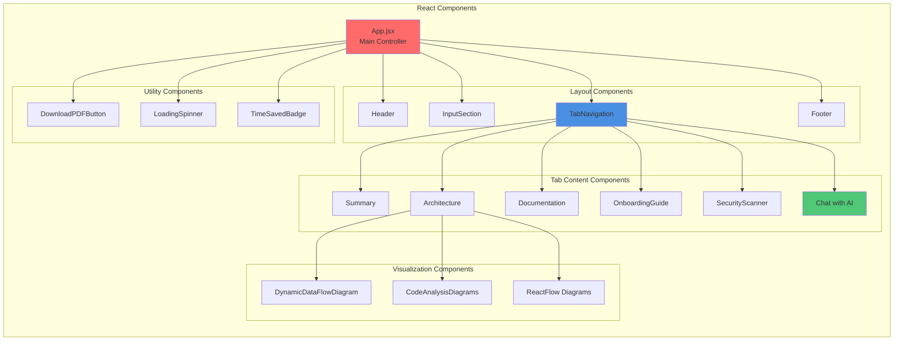

# 02 - Component Architecture

## React Component Structure

This document details the component hierarchy and organization of the DevDock React application.

## Component Hierarchy Diagram



## Component Details

### 1. App.jsx (Main Controller)
**Location**: `src/App.jsx`  
**Lines**: 1070 lines  
**Purpose**: Main application controller and state manager

**Key Responsibilities**:
- Central state management (20+ state variables)
- Repository analysis orchestration
- AI integration coordination
- Tab navigation control
- PDF generation
- Error handling

**State Management**:
```javascript
// Repository State
const [repoUrl, setRepoUrl] = useState('')
const [repoData, setRepoData] = useState(null)
const [repoSize, setRepoSize] = useState(0)

// Analysis State
const [isAnalyzing, setIsAnalyzing] = useState(false)
const [analysisComplete, setAnalysisComplete] = useState(false)

// AI State
const [aiSummary, setAiSummary] = useState('')
const [architectureAnalysis, setArchitectureAnalysis] = useState('')
const [codeAnalysis, setCodeAnalysis] = useState(null)

// Tab State
const [activeTab, setActiveTab] = useState('summary')

// Loading States
const [isSummaryLoading, setIsSummaryLoading] = useState(false)
const [isArchitectureLoading, setIsArchitectureLoading] = useState(false)
const [isCodeAnalysisLoading, setIsCodeAnalysisLoading] = useState(false)
```

### 2. Layout Components

#### Header Component
**Location**: `src/components/Header.jsx`  
**Purpose**: Application header with branding and navigation

**Features**:
- DevDock logo display
- Application title
- Responsive design

#### Footer Component
**Location**: `src/components/Footer.jsx`  
**Purpose**: Application footer with credits

**Features**:
- Copyright information
- "Made with Bob" attribution
- Links and credits

#### InputSection Component
**Location**: `src/components/InputSection.jsx`  
**Purpose**: GitHub URL input and analysis trigger

**Features**:
- URL input field
- Analyze button
- Quick onboard button
- Validation feedback
- Loading states

#### TabNavigation Component
**Location**: `src/components/TabNavigation.jsx`  
**Purpose**: Tab switching interface

**Features**:
- 6 main tabs (Summary, Architecture, Documentation, Onboarding, Security, Chat)
- Active tab highlighting
- Responsive tab layout
- Tab state management

### 3. Tab Content Components

#### Summary Component
**Location**: `src/components/TabContent/Summary.jsx`  
**Purpose**: Display AI-generated repository summary

**Features**:
- Repository overview
- Key insights
- Technology highlights
- Complexity metrics

#### Architecture Component
**Location**: `src/components/TabContent/Architecture.jsx`  
**Purpose**: Display architecture analysis and diagrams

**Features**:
- Architecture pattern detection
- Component visualization
- Technology stack display
- Interactive diagrams
- Markdown parsing and formatting

#### Documentation Component
**Location**: `src/components/TabContent/Documentation.jsx`  
**Purpose**: Display generated documentation

**Features**:
- Quick start guide
- Setup instructions
- Key commands
- Environment variables

#### OnboardingGuide Component
**Location**: `src/components/TabContent/OnboardingGuide.jsx`  
**Purpose**: Display onboarding recommendations

**Features**:
- First contribution suggestions
- Common issues and solutions
- Learning resources
- Task prioritization

#### SecurityScanner Component
**Location**: `src/components/TabContent/SecurityScanner.jsx`  
**Purpose**: Display security analysis results

**Features**:
- Vulnerability scanning
- Security best practices
- Dependency analysis
- Risk assessment

#### Chat Component
**Location**: `src/components/TabContent/Chat.jsx`  
**Purpose**: Interactive AI chat interface

**Features**:
- Real-time chat with watsonx.ai
- Context-aware responses
- Response caching
- Suggested questions
- Chat history
- Markdown rendering

**Chat Architecture**:
```javascript
class ResponseCache {
  constructor(maxSize = 50, ttl = 3600000) {
    this.cache = new Map()
    this.maxSize = maxSize
    this.ttl = ttl
  }
  
  get(question) { /* ... */ }
  set(question, response) { /* ... */ }
  getStats() { /* ... */ }
}
```

### 4. Visualization Components

#### DynamicDataFlowDiagram Component
**Location**: `src/components/TabContent/DynamicDataFlowDiagram.jsx`  
**Purpose**: Interactive data flow visualization

**Features**:
- ReactFlow integration
- Node and edge rendering
- Zoom and pan controls
- Auto-layout with Dagre
- Component relationships

#### CodeAnalysisDiagrams Component
**Location**: `src/components/TabContent/CodeAnalysisDiagrams.jsx`  
**Purpose**: Code structure visualizations

**Features**:
- Function call flow diagrams
- File structure diagrams
- Class hierarchy visualization
- Import dependency graphs

#### ReactFlow Integration
**Technology**: ReactFlow 11.11.4  
**Purpose**: Interactive node-based diagrams

**Features**:
- Draggable nodes
- Zoomable canvas
- Mini-map navigation
- Custom node types
- Edge routing

### 5. Utility Components

#### DownloadPDFButton Component
**Location**: `src/components/DownloadPDFButton.jsx`  
**Purpose**: PDF export functionality

**Features**:
- Multi-section PDF generation
- Custom styling
- Progress indication
- Error handling

#### LoadingSpinner Component
**Location**: `src/components/LoadingSpinner.jsx`  
**Purpose**: Loading state indicator

**Features**:
- Animated spinner
- Customizable size
- Loading messages

#### TimeSavedBadge Component
**Location**: `src/components/TimeSavedBadge.jsx`  
**Purpose**: Display time savings metric

**Features**:
- Calculation of time saved
- Visual badge display
- Comparison metrics

### 6. Homepage Components

**Location**: `src/components/Homepage/`

- **HeroSection.jsx**: Landing page hero
- **FeaturesGrid.jsx**: Feature highlights
- **HowItWorks.jsx**: Process explanation
- **ImpactComparison.jsx**: Before/after comparison
- **ProductivityHighlight.jsx**: Productivity metrics
- **PoweredByBob.jsx**: Technology credits
- **CTASection.jsx**: Call-to-action

## Component Communication

### Props Flow
```
App (State)
  ↓ props
TabNavigation (activeTab, setActiveTab)
  ↓ props
Tab Components (data, loading states)
  ↓ props
Visualization Components (analysis data)
```

### Event Flow
```
User Input
  ↓
InputSection (onChange, onClick)
  ↓
App (handleAnalyze)
  ↓
Services (GitHub, Watsonx)
  ↓
State Updates
  ↓
Component Re-render
```

## Styling Approach

### CSS Files
- `src/App.css`: Main application styles
- `src/index.css`: Global styles
- `src/components/PreviewPanel.css`: Preview panel styles
- `src/components/Homepage/Homepage.css`: Homepage styles

### Styling Strategy
- Component-scoped CSS
- Responsive design
- Modern CSS features
- Consistent color scheme
- Accessibility considerations

## Performance Optimizations

### Lazy Loading
- Tab content loaded on demand
- Diagrams rendered when visible
- Images lazy loaded

### Memoization
- Expensive calculations cached
- Component re-renders minimized
- Props comparison optimized

### Code Splitting
- Route-based splitting
- Component-level splitting
- Dynamic imports

---

**Previous**: [01 - High-Level Architecture](./01_High_Level_Architecture.md)  
**Next**: [03 - Data Flow Architecture](./03_Data_Flow_Architecture.md)