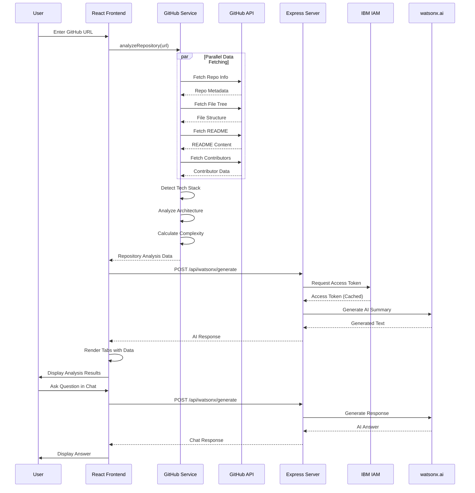
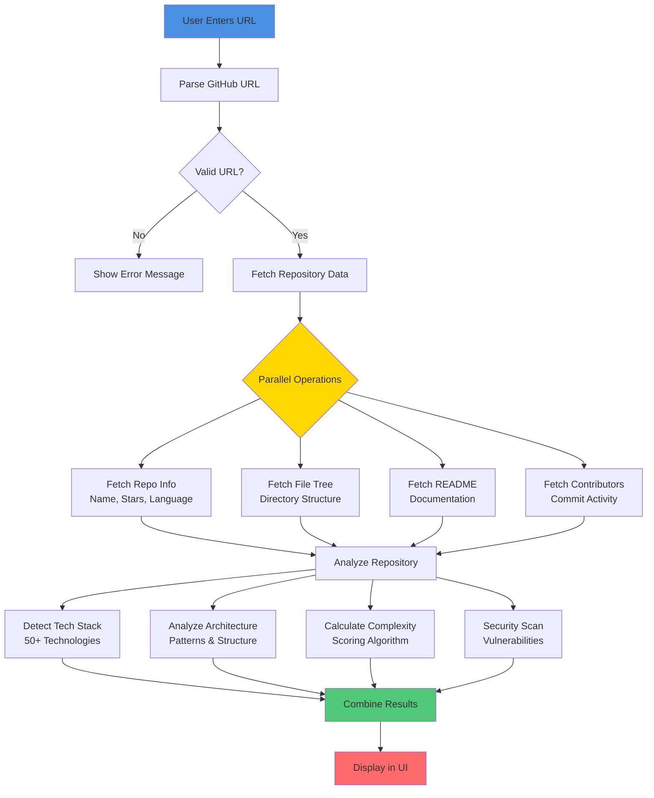
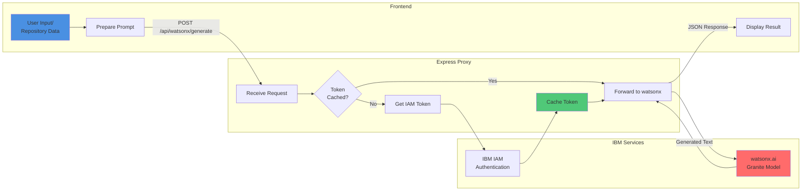
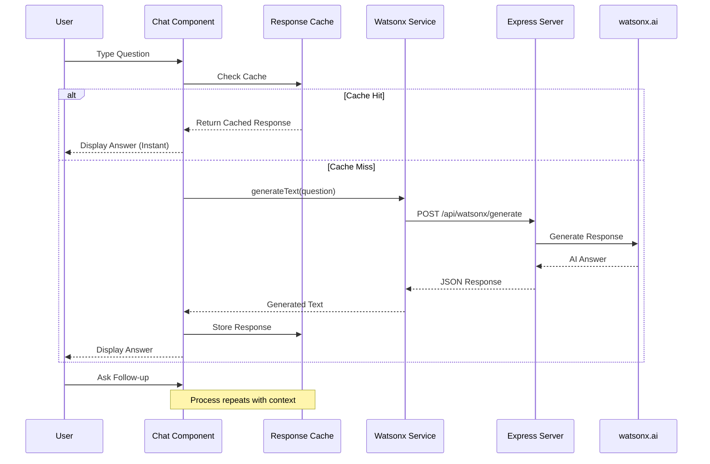
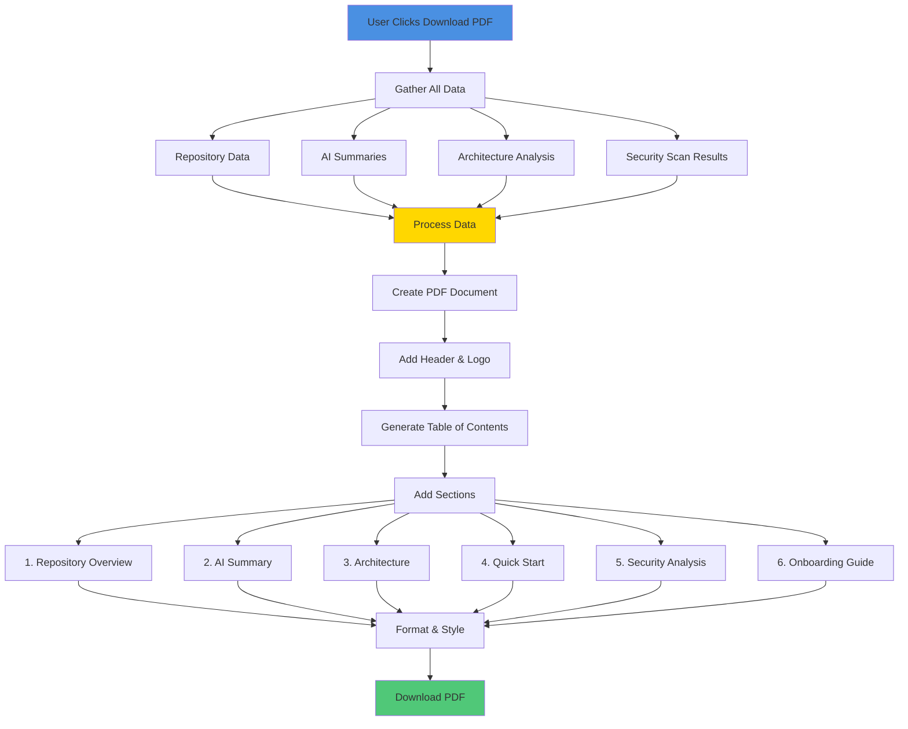
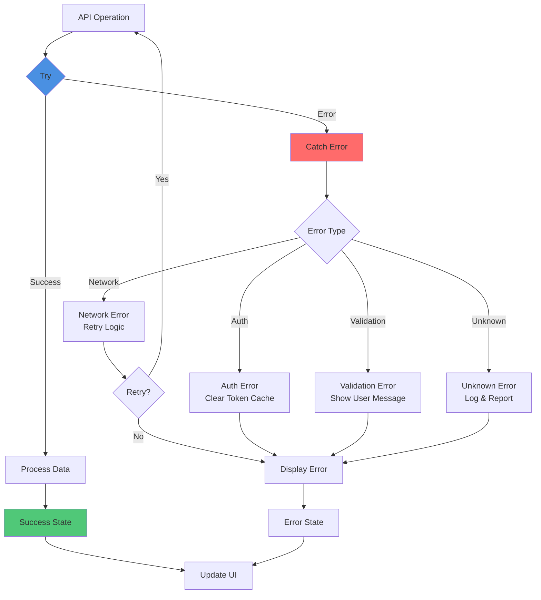
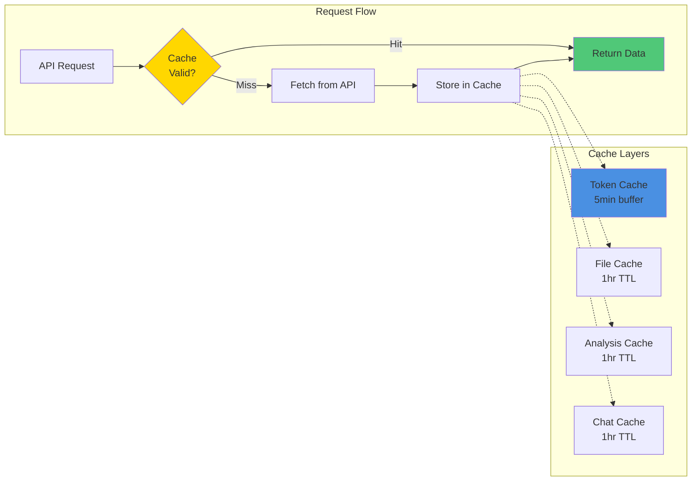
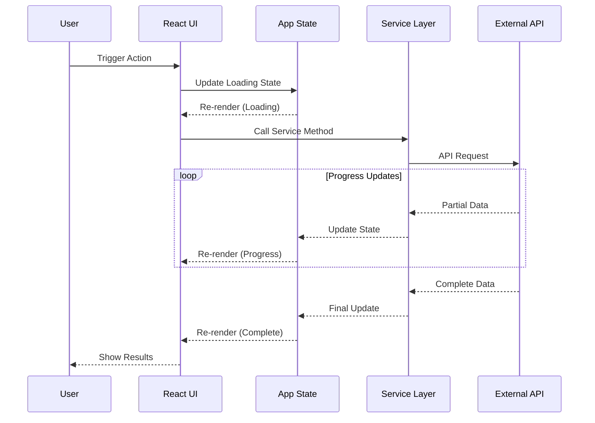

# 03 - Data Flow Architecture

## System Data Flow and Sequence Diagrams

This document illustrates how data flows through the DevDock system, from user input to final output.

## Complete Data Flow Sequence



## Repository Analysis Flow



## AI Generation Flow



## Chat Interaction Flow



## PDF Generation Flow



## Data Transformation Pipeline

```mermaid
graph LR
    subgraph "Raw Data"
        GH[GitHub API<br/>JSON Response]
        Files[File Contents<br/>Base64 Encoded]
    end
    
    subgraph "Processing"
        Parse[Parse & Decode]
        Extract[Extract Patterns]
        Analyze[Analyze Structure]
        Detect[Detect Technologies]
    end
    
    subgraph "AI Enhancement"
        Prepare[Prepare Prompts]
        Generate[Generate Insights]
        Clean[Clean Output]
    end
    
    subgraph "Presentation"
        Format[Format for Display]
        Render[Render Components]
        Export[Export Options]
    end
    
    GH --> Parse
    Files --> Parse
    Parse --> Extract
    Extract --> Analyze
    Analyze --> Detect
    
    Detect --> Prepare
    Prepare --> Generate
    Generate --> Clean
    
    Clean --> Format
    Format --> Render
    Render --> Export
    
    style GH fill:#333
    style Generate fill:#FF6B6B
    style Render fill:#4A90E2
```



## State Update Flow

```mermaid
graph TD
    Action[User Action] --> Handler[Event Handler]
    Handler --> Service[Service Call]
    
    Service --> API{API Type}
    
    API -->|GitHub| GHCall[GitHub API Call]
    API -->|Watsonx| WXCall[Watsonx API Call]
    
    GHCall --> GHResponse[Process Response]
    WXCall --> WXResponse[Process Response]
    
    GHResponse --> Update[Update State]
    WXResponse --> Update
    
    Update --> SetState[setState()]
    SetState --> Rerender[Component Re-render]
    Rerender --> UI[Update UI]
    
    UI --> User[User Sees Update]
    
    style Action fill:#4A90E2
    style Update fill:#FFD700
    style User fill:#50C878
```

## Error Handling Flow



## Caching Strategy Flow



## Real-time Update Flow



## Key Data Flow Patterns

### 1. **Parallel Fetching**
- Multiple GitHub API calls simultaneously
- Reduces total loading time
- Improves user experience

### 2. **Progressive Enhancement**
- Display data as it becomes available
- Show loading states for pending data
- Graceful degradation on errors

### 3. **Optimistic Updates**
- Update UI immediately
- Revert on error
- Better perceived performance

### 4. **Lazy Loading**
- Load tab content on demand
- Reduce initial bundle size
- Faster initial page load

### 5. **Caching Strategy**
- Multi-layer caching
- TTL-based expiration
- LRU eviction policy

---

**Previous**: [02 - Component Architecture](./02_Component_Architecture.md)  
**Next**: [04 - Service Layer Architecture](./04_Service_Layer_Architecture.md)