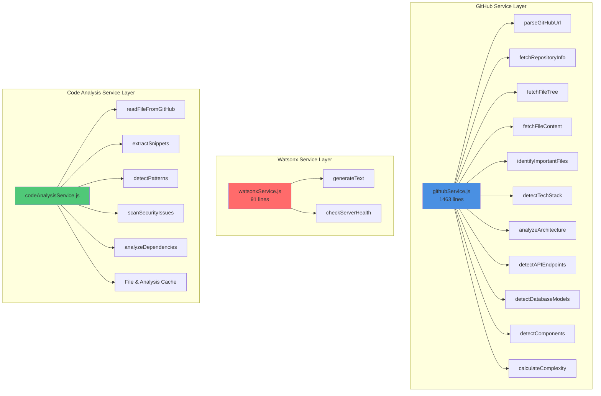
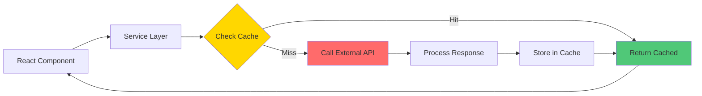

# 04 - Service Layer Architecture

## Service Layer Design and Implementation

This document details the service layer architecture, which handles all business logic and external API interactions.

## Service Layer Overview



## 1. GitHub Service (githubService.js)

**Location**: `src/services/githubService.js`  
**Size**: 1463 lines  
**Purpose**: Comprehensive GitHub repository analysis

### Core Functions

#### parseGitHubUrl(url)
```javascript
/**
 * Parse GitHub URL to extract owner and repo
 * @param {string} url - GitHub repository URL
 * @returns {Object} { owner, repo }
 */
```
**Supported Formats**:
- `https://github.com/owner/repo`
- `https://github.com/owner/repo.git`
- `github.com/owner/repo`
- `owner/repo`

#### fetchRepositoryInfo(owner, repo, token)
```javascript
/**
 * Fetch basic repository information
 * @returns {Object} Repository metadata
 */
```
**Returns**:
- name, description, url
- stars, language, license
- createdAt, updatedAt
- defaultBranch, topics

#### fetchFileTree(owner, repo, branch, token)
```javascript
/**
 * Fetch complete file tree recursively
 * @returns {Array} File tree structure
 */
```
**Features**:
- Recursive directory traversal
- File type detection
- Path normalization

#### identifyImportantFiles(fileTree)
```javascript
/**
 * Identify critical files for analysis
 * @returns {Array} Prioritized file list
 */
```
**Priority Files**:
1. README.md (priority: 1)
2. package.json (priority: 2)
3. Configuration files (priority: 3)
4. Entry points (priority: 4)
5. Documentation (priority: 5)

### Technology Detection

#### detectTechStack(fileTree, packageJson)
```javascript
/**
 * Detect 50+ technologies from file patterns
 * @returns {Object} Categorized tech stack
 */
```

**Detection Categories**:

**Frontend Frameworks**:
- React, Vue, Angular, Svelte
- Next.js, Nuxt.js, Gatsby
- Ember, Backbone

**Backend Frameworks**:
- Express, Koa, Fastify
- Django, Flask, FastAPI
- Spring Boot, Laravel
- Ruby on Rails, ASP.NET

**Databases**:
- MongoDB, PostgreSQL, MySQL
- Redis, SQLite, Cassandra
- Firebase, Supabase

**Build Tools**:
- Webpack, Vite, Rollup
- Parcel, esbuild, Turbopack

**Testing**:
- Jest, Mocha, Jasmine
- Cypress, Playwright, Selenium
- Vitest, Testing Library

**DevOps**:
- Docker, Kubernetes
- GitHub Actions, Jenkins
- Terraform, Ansible

### Architecture Analysis

#### analyzeArchitecture(fileTree, importantFiles)
```javascript
/**
 * Analyze project architecture and patterns
 * @returns {Object} Architecture insights
 */
```

**Analysis Includes**:
- File structure analysis
- Code metrics (LOC, functions, classes)
- Import/export patterns
- Component detection
- API endpoint detection
- Database model detection

#### detectArchitecturalPattern(fileTree)
```javascript
/**
 * Detect architectural patterns
 * @returns {string} Pattern name
 */
```

**Detected Patterns**:
- MVC (Model-View-Controller)
- MVVM (Model-View-ViewModel)
- Microservices
- Monolithic
- Serverless
- JAMstack
- Layered Architecture

### Component Detection

#### detectComponents(fileTree, techStack)
```javascript
/**
 * Detect UI components
 * @returns {Array} Component list
 */
```

**Supports**:
- React components (.jsx, .tsx)
- Vue components (.vue)
- Angular components (.component.ts)
- Web Components

#### detectAPIEndpoints(fileTree)
```javascript
/**
 * Detect API routes and endpoints
 * @returns {Array} API endpoints
 */
```

**Detects**:
- Express routes
- FastAPI endpoints
- Django URLs
- Spring Boot controllers

#### detectDatabaseModels(fileTree)
```javascript
/**
 * Detect database models and schemas
 * @returns {Array} Model definitions
 */
```

**Supports**:
- Mongoose schemas
- Sequelize models
- TypeORM entities
- Prisma schemas

### Complexity Analysis

#### calculateComplexity(repoData)
```javascript
/**
 * Calculate repository complexity score
 * @returns {Object} Complexity metrics
 */
```

**Factors**:
- File count
- Lines of code
- Technology diversity
- Dependency count
- Architecture complexity

**Scoring**:
- 0-30: Simple
- 31-60: Moderate
- 61-80: Complex
- 81-100: Very Complex

**Time Estimates**:
- DevDock: Minutes
- Traditional: Hours/Days

### Utility Functions

#### extractFunctions(content, filePath)
```javascript
/**
 * Extract function definitions from code
 * @returns {Array} Function list
 */
```

#### extractClasses(content, filePath)
```javascript
/**
 * Extract class definitions from code
 * @returns {Array} Class list
 */
```

#### extractImports(content, filePath)
```javascript
/**
 * Extract import statements
 * @returns {Array} Import list
 */
```

#### extractEnvVariables(content)
```javascript
/**
 * Extract environment variables from .env files
 * @returns {Array} Environment variables
 */
```

## 2. Watsonx Service (watsonxService.js)

**Location**: `src/services/watsonxService.js`  
**Size**: 91 lines  
**Purpose**: IBM watsonx.ai integration

### Core Functions

#### generateText(prompt, options)
```javascript
/**
 * Generate text using IBM watsonx.ai Granite model
 * @param {string} prompt - Text prompt
 * @param {Object} options - Generation parameters
 * @returns {Promise<string>} Generated text
 */
```

**Options**:
```javascript
{
  decodingMethod: 'greedy',      // or 'sample'
  maxNewTokens: 200,              // Max tokens to generate
  minNewTokens: 1,                // Min tokens to generate
  temperature: 0.7,               // Sampling temperature (0-2)
  topP: 1,                        // Top-p sampling
  topK: 50,                       // Top-k sampling
  stopSequences: [],              // Stop generation sequences
  repetitionPenalty: 1.0          // Repetition penalty
}
```

**Flow**:
1. Validate prompt
2. Send request to Express backend
3. Backend handles IAM authentication
4. Backend calls watsonx.ai API
5. Return generated text

#### checkServerHealth()
```javascript
/**
 * Check if backend server is running
 * @returns {Promise<Object>} Health status
 */
```

**Returns**:
```javascript
{
  status: 'ok',
  message: 'Watsonx.ai proxy server is running',
  config: {
    hasApiKey: true,
    hasProjectId: true,
    regionUrl: 'https://us-south.ml.cloud.ibm.com',
    modelId: 'ibm/granite-13b-chat-v2'
  }
}
```

### Error Handling

**Connection Errors**:
```javascript
if (error.message.includes('Failed to fetch')) {
  throw new Error(
    'Cannot connect to backend server. Make sure the server is running on port 5001.'
  );
}
```

**Authentication Errors**:
```javascript
if (response.status === 401) {
  throw new Error('Authentication token expired');
}
```

## 3. Code Analysis Service (codeAnalysisService.js)

**Location**: `src/services/codeAnalysisService.js`  
**Purpose**: Deep code analysis and pattern detection

### Class Structure

```javascript
class CodeAnalysisService {
  constructor() {
    this.fileCache = new Map();
    this.analysisCache = new Map();
    this.maxCacheSize = 100;
    this.cacheTTL = 3600000; // 1 hour
  }
}
```

### Core Methods

#### readFileFromGitHub(owner, repo, path, token)
```javascript
/**
 * Read file contents from GitHub API
 * @returns {Promise<string>} File content
 */
```

**Features**:
- Base64 decoding
- Cache management
- Error handling
- Rate limit awareness

#### extractSnippets(fileContent, keywords, contextLines)
```javascript
/**
 * Extract code snippets based on keywords
 * @param {string} fileContent - File content
 * @param {Array} keywords - Keywords to search
 * @param {number} contextLines - Lines of context
 * @returns {Array} Code snippets
 */
```

**Returns**:
```javascript
[
  {
    keyword: 'function',
    lineNumber: 42,
    snippet: '...',
    context: 5
  }
]
```

#### detectPatterns(fileContent, filePath)
```javascript
/**
 * Detect code patterns and frameworks
 * @returns {Object} Detected patterns
 */
```

**Detects**:
- Design patterns (Singleton, Factory, Observer)
- Framework patterns (MVC, MVVM)
- Code smells
- Best practices

#### scanSecurityIssues(fileContent, filePath)
```javascript
/**
 * Scan for security vulnerabilities
 * @returns {Array} Security issues
 */
```

**Checks**:
- Hardcoded credentials
- SQL injection risks
- XSS vulnerabilities
- Insecure dependencies
- Exposed secrets

#### analyzeDependencies(packageJson)
```javascript
/**
 * Analyze project dependencies
 * @returns {Object} Dependency analysis
 */
```

**Analysis**:
- Outdated packages
- Security vulnerabilities
- License compatibility
- Dependency tree depth

### Caching Strategy

```javascript
cacheFile(key, content) {
  // LRU eviction
  if (this.fileCache.size >= this.maxCacheSize) {
    const oldestKey = this.fileCache.keys().next().value;
    this.fileCache.delete(oldestKey);
  }
  
  this.fileCache.set(key, {
    content,
    timestamp: Date.now()
  });
}
```

## Service Integration Pattern



## Error Handling Strategy

```javascript
try {
  const result = await service.method();
  return result;
} catch (error) {
  console.error('Service error:', error);
  
  // Categorize error
  if (error.message.includes('rate limit')) {
    // Handle rate limiting
  } else if (error.message.includes('authentication')) {
    // Handle auth errors
  } else {
    // Generic error handling
  }
  
  throw error;
}
```

## Performance Optimizations

### 1. **Parallel Requests**
```javascript
const [repoInfo, fileTree, readme] = await Promise.all([
  fetchRepositoryInfo(owner, repo, token),
  fetchFileTree(owner, repo, branch, token),
  fetchFileContent(owner, repo, 'README.md', token)
]);
```

### 2. **Request Batching**
```javascript
const files = await Promise.all(
  importantFiles.map(file => 
    fetchFileContent(owner, repo, file.path, token)
  )
);
```

### 3. **Lazy Loading**
```javascript
// Load only when needed
if (activeTab === 'architecture') {
  const analysis = await analyzeArchitecture(fileTree, files);
}
```

### 4. **Memoization**
```javascript
const memoizedAnalysis = useMemo(() => {
  return analyzeRepository(repoData);
}, [repoData]);
```

---

**Previous**: [03 - Data Flow Architecture](./03_Data_Flow_Architecture.md)  
**Next**: [05 - Authentication & Security Flow](./05_Authentication_Security_Flow.md)