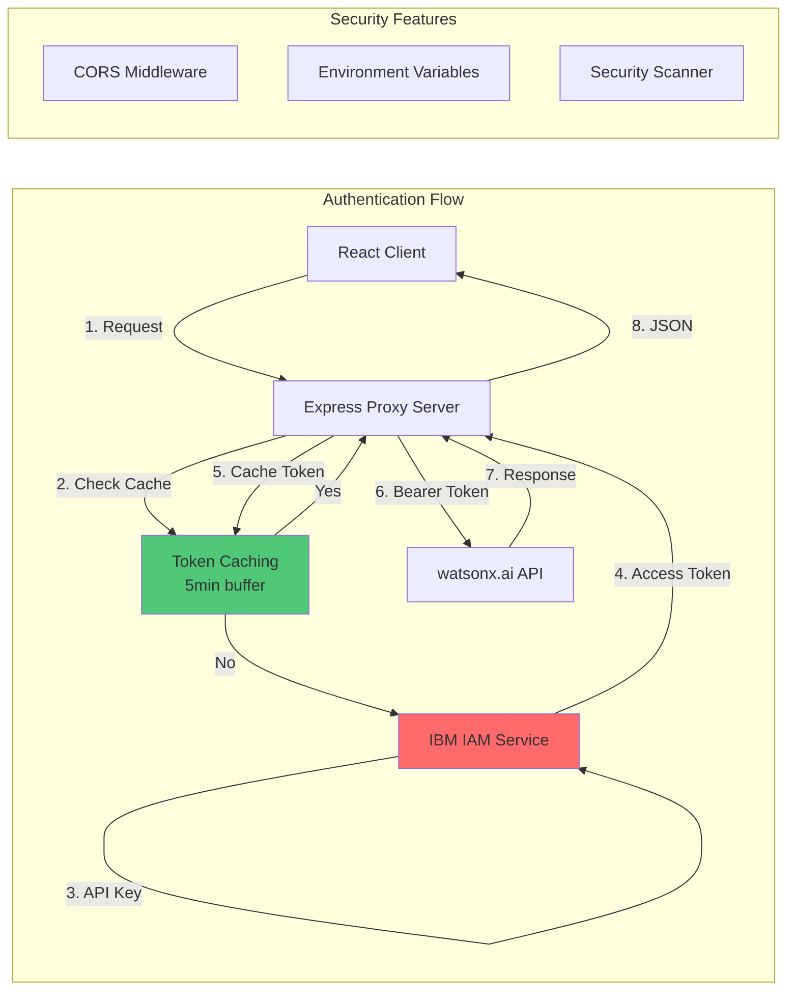
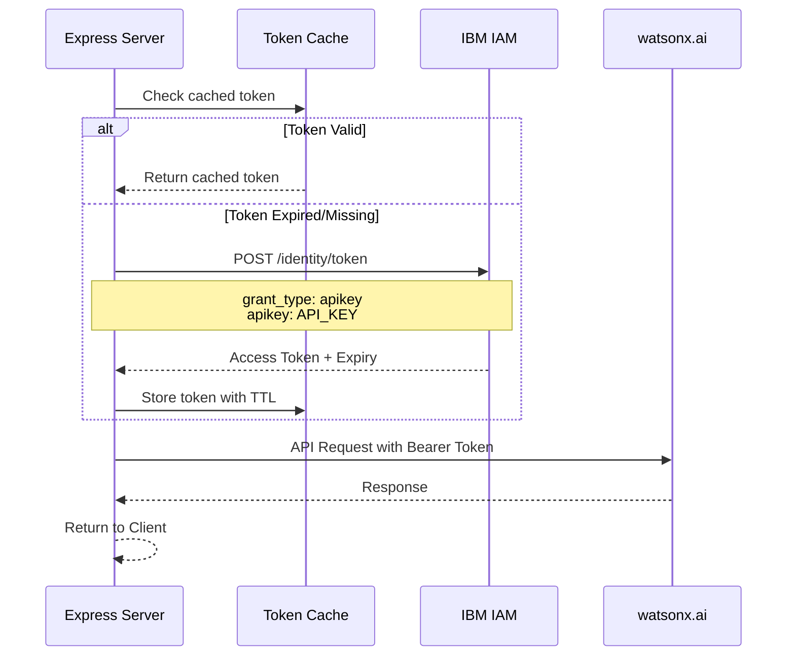
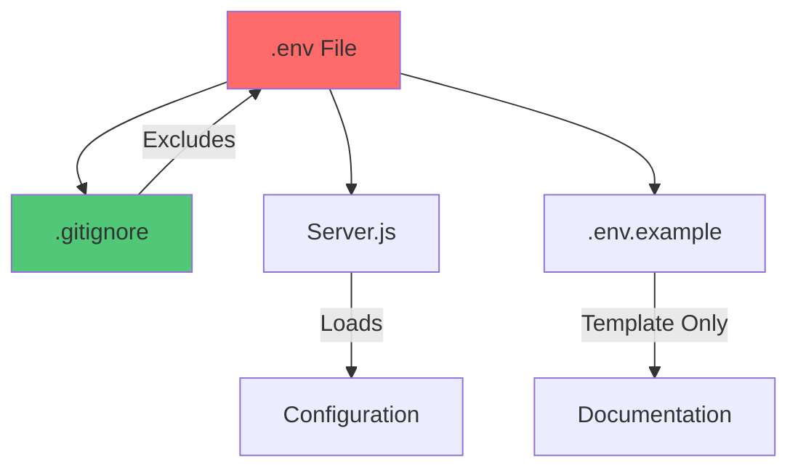
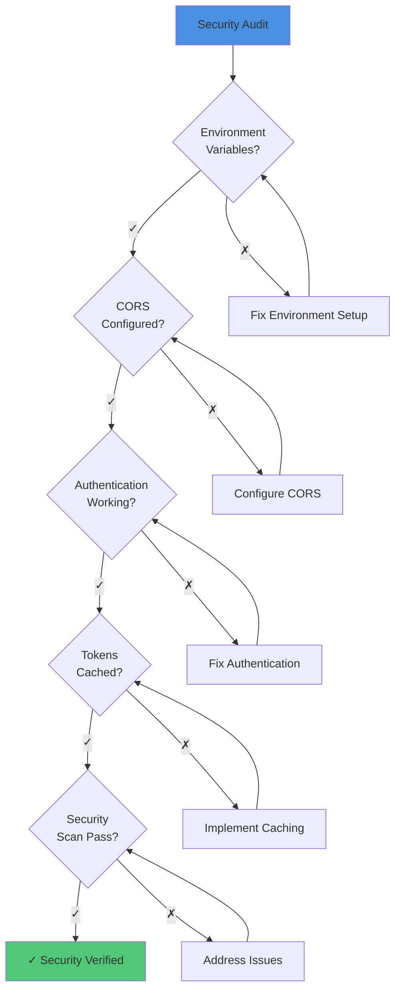

# 05 - Authentication & Security Flow

## Authentication and Security Architecture

This document details the authentication mechanisms and security measures implemented in DevDock.

## Authentication Flow



## IBM IAM Authentication

### Token Acquisition Flow



### Token Management

**Location**: `server.js` (lines 38-91)

```javascript
// Token cache
let cachedToken = null;
let tokenExpiry = null;

async function getAccessToken() {
  // Return cached token if still valid (with 5 minute buffer)
  if (cachedToken && tokenExpiry && Date.now() < tokenExpiry - 300000) {
    console.log('Using cached IAM token');
    return cachedToken;
  }

  console.log('Fetching new IAM access token...');

  const response = await fetch('https://iam.cloud.ibm.com/identity/token', {
    method: 'POST',
    headers: {
      'Content-Type': 'application/x-www-form-urlencoded',
      'Accept': 'application/json',
    },
    body: new URLSearchParams({
      grant_type: 'urn:ibm:params:oauth:grant-type:apikey',
      apikey: WATSONX_CONFIG.apiKey,
    }),
  });

  const data = await response.json();
  
  // Cache the token
  cachedToken = data.access_token;
  tokenExpiry = Date.now() + (data.expires_in * 1000);

  return cachedToken;
}
```

**Key Features**:
- **Token Caching**: Reduces IAM API calls
- **5-Minute Buffer**: Prevents token expiry during requests
- **Automatic Refresh**: Fetches new token when expired
- **Error Handling**: Clears cache on authentication failure

## CORS Configuration

### Express CORS Middleware

**Location**: `server.js` (lines 13-25)

```javascript
// Simple CORS middleware - allow everything
app.use((req, res, next) => {
  res.header('Access-Control-Allow-Origin', '*');
  res.header('Access-Control-Allow-Methods', 'GET, POST, PUT, DELETE, OPTIONS');
  res.header('Access-Control-Allow-Headers', 'Origin, X-Requested-With, Content-Type, Accept, Authorization');
  
  // Handle preflight
  if (req.method === 'OPTIONS') {
    return res.sendStatus(200);
  }
  
  next();
});
```

**Purpose**:
- Allow cross-origin requests from React frontend
- Handle preflight OPTIONS requests
- Support all HTTP methods
- Allow necessary headers

### React Proxy Configuration

**Location**: `src/setupProxy.js`

```javascript
const { createProxyMiddleware } = require('http-proxy-middleware');

module.exports = function(app) {
  app.use(
    '/api',
    createProxyMiddleware({
      target: 'http://localhost:5001',
      changeOrigin: true,
    })
  );
};
```

**Benefits**:
- Avoids CORS issues in development
- Seamless API routing
- Simplified configuration

## Security Measures

### 1. Environment Variable Protection



**Protected Variables**:
```bash
REACT_APP_WATSONX_API_KEY=your_api_key_here
REACT_APP_WATSONX_PROJECT_ID=your_project_id
REACT_APP_WATSONX_REGION_URL=https://us-south.ml.cloud.ibm.com
REACT_APP_WATSONX_MODEL_ID=ibm/granite-13b-chat-v2
PORT=5001
```

**Security Practices**:
- Never commit `.env` to version control
- Use `.env.example` as template
- Rotate keys regularly
- Use different keys for dev/prod

### 2. API Key Management

```javascript
// Configuration from environment variables
const WATSONX_CONFIG = {
  apiKey: process.env.REACT_APP_WATSONX_API_KEY,
  projectId: process.env.REACT_APP_WATSONX_PROJECT_ID,
  regionUrl: process.env.REACT_APP_WATSONX_REGION_URL,
  modelId: process.env.REACT_APP_WATSONX_MODEL_ID,
};

// Validate configuration
if (!WATSONX_CONFIG.apiKey || !WATSONX_CONFIG.projectId) {
  console.error('Missing required environment variables');
  process.exit(1);
}
```

### 3. Request Validation

```javascript
app.post('/api/watsonx/generate', async (req, res) => {
  try {
    const { prompt, options = {} } = req.body;

    // Validate input
    if (!prompt) {
      return res.status(400).json({ error: 'Prompt is required' });
    }

    // Validate prompt length
    if (prompt.length > 10000) {
      return res.status(400).json({ error: 'Prompt too long' });
    }

    // Process request...
  } catch (error) {
    res.status(500).json({ error: error.message });
  }
});
```

### 4. Error Handling

```javascript
// Categorized error responses
if (response.status === 401) {
  cachedToken = null;
  tokenExpiry = null;
  return res.status(401).json({ error: 'Authentication token expired' });
}

if (response.status === 429) {
  return res.status(429).json({ error: 'Rate limit exceeded' });
}

if (response.status === 500) {
  return res.status(500).json({ error: 'Internal server error' });
}
```

## Security Scanner

### Code Analysis Security Checks

**Location**: `src/services/codeAnalysisService.js`

```javascript
scanSecurityIssues(fileContent, filePath) {
  const issues = [];
  
  // Check for hardcoded credentials
  const credentialPatterns = [
    /password\s*=\s*['"][^'"]+['"]/gi,
    /api[_-]?key\s*=\s*['"][^'"]+['"]/gi,
    /secret\s*=\s*['"][^'"]+['"]/gi,
    /token\s*=\s*['"][^'"]+['"]/gi,
  ];
  
  // Check for SQL injection risks
  const sqlPatterns = [
    /execute\s*\(\s*['"].*\$.*['"]/gi,
    /query\s*\(\s*['"].*\+.*['"]/gi,
  ];
  
  // Check for XSS vulnerabilities
  const xssPatterns = [
    /innerHTML\s*=/gi,
    /dangerouslySetInnerHTML/gi,
  ];
  
  // Scan and report issues
  // ...
}
```

### Security Scan Results

```javascript
{
  passed_checks: [
    "No hardcoded credentials found",
    "HTTPS enforced",
    "Environment variables used correctly"
  ],
  issues: [
    {
      severity: "high",
      type: "Exposed Secret",
      file: "config.js",
      line: 42,
      description: "Potential API key in source code"
    }
  ],
  recommendations: [
    "Use environment variables for all secrets",
    "Enable dependency scanning",
    "Implement rate limiting"
  ]
}
```

## GitHub API Security

### Token Usage

```javascript
// GitHub API calls with authentication
const response = await fetch(
  `https://api.github.com/repos/${owner}/${repo}`,
  {
    headers: {
      'Authorization': `token ${token}`,
      'Accept': 'application/vnd.github.v3+json'
    }
  }
);
```

**Best Practices**:
- Use personal access tokens (PAT)
- Limit token scope to read-only
- Never expose tokens in client-side code
- Rotate tokens regularly

### Rate Limiting

```javascript
// Handle GitHub rate limits
if (response.status === 403) {
  const rateLimitRemaining = response.headers.get('X-RateLimit-Remaining');
  const rateLimitReset = response.headers.get('X-RateLimit-Reset');
  
  if (rateLimitRemaining === '0') {
    throw new Error(`Rate limit exceeded. Resets at ${new Date(rateLimitReset * 1000)}`);
  }
}
```

## Data Privacy

### 1. No Data Storage
- DevDock does not store repository data
- All analysis is performed in-memory
- No database or persistent storage

### 2. Client-Side Processing
- Repository analysis happens in the browser
- Only AI prompts sent to backend
- Minimal data transmission

### 3. Secure Communication
- HTTPS enforced in production
- Encrypted API communications
- Secure token transmission

## Security Checklist



## Security Best Practices

### 1. **API Keys**
- ✅ Store in environment variables
- ✅ Never commit to version control
- ✅ Use different keys for environments
- ✅ Rotate regularly

### 2. **Authentication**
- ✅ Token caching with expiry
- ✅ Automatic token refresh
- ✅ Secure token transmission
- ✅ Error handling for auth failures

### 3. **CORS**
- ✅ Proper CORS configuration
- ✅ Whitelist allowed origins
- ✅ Handle preflight requests
- ✅ Secure headers

### 4. **Input Validation**
- ✅ Validate all user inputs
- ✅ Sanitize data before processing
- ✅ Limit input sizes
- ✅ Type checking

### 5. **Error Handling**
- ✅ Don't expose sensitive errors
- ✅ Log errors securely
- ✅ Provide user-friendly messages
- ✅ Handle edge cases

---

**Previous**: [04 - Service Layer Architecture](./04_Service_Layer_Architecture.md)  
**Next**: [06 - Frontend State Management](./06_Frontend_State_Management.md)