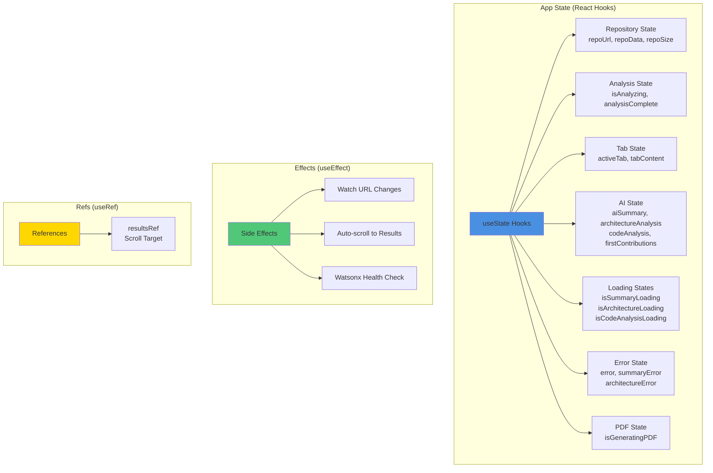
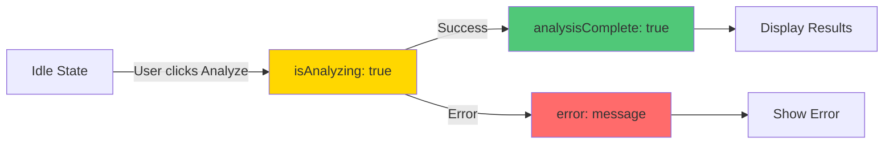
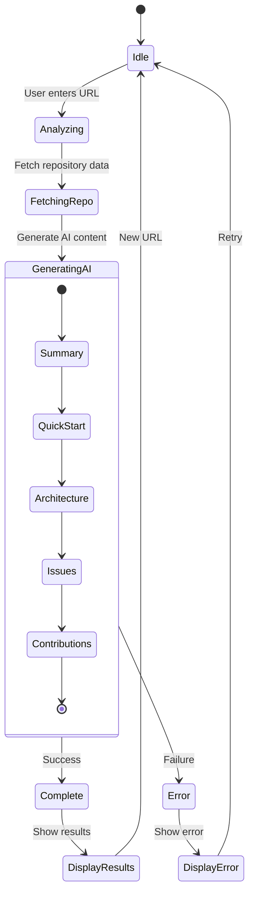

# 06 - Frontend State Management

## React State Management Architecture

This document details how state is managed in the DevDock React application using hooks and context.

## State Architecture Overview



## State Variables

### 1. Repository State

```javascript
// URL and basic info
const [repoUrl, setRepoUrl] = useState('');
const [previousUrl, setPreviousUrl] = useState('');
const [repoSize, setRepoSize] = useState(0);

// Complete repository data
const [repoData, setRepoData] = useState(null);
```

**Purpose**:
- Track current repository URL
- Store complete repository analysis
- Monitor repository size
- Detect URL changes

**Data Structure**:
```javascript
repoData = {
  repoInfo: {
    name: string,
    description: string,
    stars: number,
    language: string,
    // ...
  },
  fileTree: Array,
  techStack: Object,
  importantFiles: Array,
  complexity: Object,
  // ...
}
```

### 2. Analysis State

```javascript
const [isAnalyzing, setIsAnalyzing] = useState(false);
const [analysisComplete, setAnalysisComplete] = useState(false);
const [successMessage, setSuccessMessage] = useState('');
const [error, setError] = useState('');
```

**Purpose**:
- Track analysis progress
- Show completion status
- Display success/error messages
- Control UI states

**State Flow**:


### 3. AI State

```javascript
// AI-generated content
const [aiSummary, setAiSummary] = useState('');
const [architectureAnalysis, setArchitectureAnalysis] = useState('');
const [detailedArchitecture, setDetailedArchitecture] = useState(null);
const [codeAnalysis, setCodeAnalysis] = useState(null);

// Onboarding content
const [quickStartGuide, setQuickStartGuide] = useState('');
const [commonIssues, setCommonIssues] = useState('');
const [firstContributions, setFirstContributions] = useState([]);
```

**Purpose**:
- Store AI-generated summaries
- Cache architecture analysis
- Hold onboarding guides
- Manage contribution suggestions

### 4. Loading States

```javascript
// Individual loading states for each AI generation
const [isSummaryLoading, setIsSummaryLoading] = useState(false);
const [isQuickStartLoading, setIsQuickStartLoading] = useState(false);
const [isIssuesLoading, setIsIssuesLoading] = useState(false);
const [isContributionsLoading, setIsContributionsLoading] = useState(false);
const [isArchitectureLoading, setIsArchitectureLoading] = useState(false);
const [isCodeAnalysisLoading, setIsCodeAnalysisLoading] = useState(false);
```

**Purpose**:
- Show loading spinners per section
- Enable progressive loading
- Improve user experience
- Allow parallel operations

**Loading Pattern**:
```javascript
const generateContent = async () => {
  setIsSummaryLoading(true);
  try {
    const summary = await generateText(prompt);
    setAiSummary(summary);
  } catch (error) {
    setError(error.message);
  } finally {
    setIsSummaryLoading(false);
  }
};
```

### 5. Error States

```javascript
const [error, setError] = useState('');
const [summaryError, setSummaryError] = useState('');
const [architectureError, setArchitectureError] = useState('');
const [codeAnalysisError, setCodeAnalysisError] = useState('');
```

**Purpose**:
- Track errors per section
- Display specific error messages
- Enable error recovery
- Maintain partial functionality

### 6. Tab State

```javascript
const [activeTab, setActiveTab] = useState('summary');

const tabs = [
  { id: 'summary', label: '📊 Summary' },
  { id: 'architecture', label: '🏗️ Architecture' },
  { id: 'documentation', label: '📚 Documentation' },
  { id: 'onboarding', label: '🚀 Onboarding' },
  { id: 'security', label: '🔒 Security' },
  { id: 'chat', label: '💬 Chat' }
];
```

**Purpose**:
- Control active tab display
- Manage tab navigation
- Lazy load tab content
- Track user navigation

### 7. PDF State

```javascript
const [isGeneratingPDF, setIsGeneratingPDF] = useState(false);
```

**Purpose**:
- Show PDF generation progress
- Disable UI during generation
- Prevent multiple generations
- Handle generation errors

## Side Effects (useEffect)

### 1. URL Change Detection

```javascript
useEffect(() => {
  if (repoUrl && repoUrl !== previousUrl) {
    // Reset all states when URL changes
    setAnalysisComplete(false);
    setAiSummary('');
    setArchitectureAnalysis('');
    setCodeAnalysis(null);
    setError('');
    setSuccessMessage('');
    setPreviousUrl(repoUrl);
  }
}, [repoUrl, previousUrl]);
```

**Purpose**:
- Detect repository URL changes
- Reset analysis states
- Clear previous results
- Prepare for new analysis

### 2. Auto-scroll to Results

```javascript
useEffect(() => {
  if (analysisComplete && resultsRef.current) {
    setTimeout(() => {
      resultsRef.current.scrollIntoView({
        behavior: 'smooth',
        block: 'start'
      });
    }, 100);
  }
}, [analysisComplete]);
```

**Purpose**:
- Scroll to results after analysis
- Improve user experience
- Focus attention on results
- Smooth animation

### 3. Watsonx Health Check

```javascript
useEffect(() => {
  const testWatsonxIntegration = async () => {
    try {
      const response = await checkServerHealth();
      console.log('✓ Watsonx.ai server is ready:', response);
    } catch (error) {
      console.error('⚠️ Watsonx.ai server check failed:', error);
    }
  };
  
  testWatsonxIntegration();
}, []);
```

**Purpose**:
- Verify backend connectivity
- Check configuration
- Early error detection
- Log status

## Refs (useRef)

### Results Reference

```javascript
const resultsRef = useRef(null);

// Usage in JSX
<div ref={resultsRef}>
  {/* Results content */}
</div>
```

**Purpose**:
- Reference DOM element
- Enable programmatic scrolling
- No re-renders on change
- Direct DOM access

## State Update Patterns

### 1. Sequential Updates

```javascript
const handleAnalyze = async () => {
  setIsAnalyzing(true);
  setError('');
  
  try {
    // Step 1: Fetch repository data
    const data = await analyzeRepository(repoUrl);
    setRepoData(data);
    
    // Step 2: Generate AI summary
    setIsSummaryLoading(true);
    const summary = await generateText(prompt);
    setAiSummary(summary);
    setIsSummaryLoading(false);
    
    // Step 3: Complete
    setAnalysisComplete(true);
    setSuccessMessage('Analysis complete!');
  } catch (error) {
    setError(error.message);
  } finally {
    setIsAnalyzing(false);
  }
};
```

### 2. Parallel Updates

```javascript
const generateAllContent = async () => {
  // Start all generations in parallel
  const [summary, quickStart, issues] = await Promise.all([
    generateText(summaryPrompt).catch(err => {
      setSummaryError(err.message);
      return '';
    }),
    generateText(quickStartPrompt).catch(err => {
      setQuickStartError(err.message);
      return '';
    }),
    generateText(issuesPrompt).catch(err => {
      setIssuesError(err.message);
      return '';
    })
  ]);
  
  // Update all states
  setAiSummary(summary);
  setQuickStartGuide(quickStart);
  setCommonIssues(issues);
};
```

### 3. Conditional Updates

```javascript
const updateArchitecture = async () => {
  if (!architectureAnalysis) {
    setIsArchitectureLoading(true);
    try {
      const analysis = await generateArchitecture();
      setArchitectureAnalysis(analysis);
    } catch (error) {
      setArchitectureError(error.message);
    } finally {
      setIsArchitectureLoading(false);
    }
  }
};
```

## State Flow Diagram



## Props Drilling vs State Lifting

### Current Approach: Props Drilling

```javascript
// App.jsx
<TabNavigation 
  activeTab={activeTab}
  setActiveTab={setActiveTab}
  tabs={tabs}
/>

<PreviewPanel>
  {renderTabContent()}
</PreviewPanel>

// renderTabContent()
switch(activeTab) {
  case 'summary':
    return <Summary 
      summary={aiSummary}
      loading={isSummaryLoading}
      error={summaryError}
    />;
  case 'architecture':
    return <Architecture
      analysis={architectureAnalysis}
      loading={isArchitectureLoading}
      error={architectureError}
    />;
  // ...
}
```

**Advantages**:
- Simple and straightforward
- Easy to understand
- No additional complexity
- Good for small apps

**Disadvantages**:
- Props passed through multiple levels
- Harder to maintain at scale
- Potential performance issues

### Alternative: Context API (Future Enhancement)

```javascript
// Create context
const AppContext = createContext();

// Provider
<AppContext.Provider value={{
  repoData,
  aiSummary,
  isAnalyzing,
  // ...
}}>
  <App />
</AppContext.Provider>

// Consumer
const { aiSummary, isAnalyzing } = useContext(AppContext);
```

## Performance Optimizations

### 1. Memoization

```javascript
const memoizedData = useMemo(() => {
  return processRepoData(repoData);
}, [repoData]);
```

### 2. Callback Memoization

```javascript
const handleTabChange = useCallback((tabId) => {
  setActiveTab(tabId);
}, []);
```

### 3. Lazy State Updates

```javascript
// Only update when tab is active
useEffect(() => {
  if (activeTab === 'architecture' && !architectureAnalysis) {
    loadArchitecture();
  }
}, [activeTab]);
```

## State Persistence

### Local Storage (Future Enhancement)

```javascript
// Save state
useEffect(() => {
  if (repoData) {
    localStorage.setItem('lastAnalysis', JSON.stringify({
      url: repoUrl,
      data: repoData,
      timestamp: Date.now()
    }));
  }
}, [repoData, repoUrl]);

// Load state
useEffect(() => {
  const saved = localStorage.getItem('lastAnalysis');
  if (saved) {
    const { url, data, timestamp } = JSON.parse(saved);
    // Check if still valid (e.g., < 1 hour old)
    if (Date.now() - timestamp < 3600000) {
      setRepoUrl(url);
      setRepoData(data);
    }
  }
}, []);
```

## State Management Best Practices

### 1. **Single Source of Truth**
- Keep state in one place
- Avoid duplicate state
- Derive values when possible

### 2. **Minimal State**
- Only store what's necessary
- Compute derived values
- Avoid redundant state

### 3. **Immutable Updates**
- Never mutate state directly
- Use spread operators
- Create new objects/arrays

### 4. **Descriptive Names**
- Clear variable names
- Consistent naming convention
- Self-documenting code

### 5. **Error Boundaries**
- Catch and handle errors
- Graceful degradation
- User-friendly messages

---

**Previous**: [05 - Authentication & Security Flow](./05_Authentication_Security_Flow.md)  
**Next**: [07 - Technology Stack](./07_Technology_Stack.md)