# 07 - Technology Stack

## Complete Technology Stack Overview

This document provides a comprehensive overview of all technologies, frameworks, and tools used in DevDock.

## Technology Stack Diagram

```mermaid
graph TB
    subgraph "Frontend Stack"
        React[React 18.2.0]
        ReactFlow[ReactFlow 11.11.4]
        Mermaid[Mermaid 11.14.0]
        HTML2PDF[html2pdf.js 0.14.0]
        Dagre[Dagre 0.8.5]
    end
    
    subgraph "Backend Stack"
        Express[Express 5.2.1]
        NodeFetch[node-fetch 2.7.0]
        CORS[cors 2.8.6]
        DotEnv[dotenv 17.4.2]
    end
    
    subgraph "External APIs"
        GitHub[GitHub REST API v3]
        WatsonX[IBM watsonx.ai<br/>Granite Model]
        IAM[IBM IAM]
    end
    
    subgraph "Development Tools"
        ReactScripts[react-scripts 5.0.1]
        Proxy[http-proxy-middleware 3.0.5]
    end
    
    React --> ReactFlow
    React --> Mermaid
    React --> HTML2PDF
    ReactFlow --> Dagre
    
    Express --> NodeFetch
    Express --> CORS
    Express --> DotEnv
    
    Express --> IAM
    Express --> WatsonX
    React --> GitHub
    
    style React fill:#61DAFB
    style Express fill:#50C878
    style WatsonX fill:#FF6B6B
    style GitHub fill:#333
```



## Frontend Technologies

### 1. React 18.2.0

**Purpose**: Core UI framework  
**Website**: https://react.dev

**Key Features Used**:
- Functional components
- React Hooks (useState, useEffect, useRef, useMemo, useCallback)
- Component composition
- Virtual DOM
- JSX syntax

**Why React?**
- Component-based architecture
- Large ecosystem
- Excellent performance
- Strong community support
- Easy to learn and use

**Usage in DevDock**:
```javascript
import React, { useState, useEffect } from 'react';

function App() {
  const [repoUrl, setRepoUrl] = useState('');
  const [repoData, setRepoData] = useState(null);
  
  useEffect(() => {
    // Side effects
  }, [repoUrl]);
  
  return (
    <div className="App">
      {/* Components */}
    </div>
  );
}
```

### 2. ReactFlow 11.11.4

**Purpose**: Interactive node-based diagrams  
**Website**: https://reactflow.dev

**Key Features**:
- Draggable nodes
- Zoomable canvas
- Custom node types
- Edge routing
- Mini-map
- Controls

**Usage in DevDock**:
```javascript
import ReactFlow, {
  MiniMap,
  Controls,
  Background,
  useNodesState,
  useEdgesState,
} from 'reactflow';

function DataFlowDiagram() {
  const [nodes, setNodes, onNodesChange] = useNodesState(initialNodes);
  const [edges, setEdges, onEdgesChange] = useEdgesState(initialEdges);
  
  return (
    <ReactFlow
      nodes={nodes}
      edges={edges}
      onNodesChange={onNodesChange}
      onEdgesChange={onEdgesChange}
    >
      <MiniMap />
      <Controls />
      <Background />
    </ReactFlow>
  );
}
```

### 3. Mermaid 11.14.0

**Purpose**: Diagram generation from text  
**Website**: https://mermaid.js.org

**Supported Diagrams**:
- Flowcharts
- Sequence diagrams
- Class diagrams
- State diagrams
- Entity relationship diagrams
- Gantt charts

**Usage in DevDock**:
```javascript
import mermaid from 'mermaid';

mermaid.initialize({
  startOnLoad: true,
  theme: 'default',
  securityLevel: 'loose',
});

// Render diagram
const diagramCode = `
  graph TD
    A[Start] --> B[Process]
    B --> C[End]
`;

mermaid.render('diagram-id', diagramCode);
```

### 4. html2pdf.js 0.14.0

**Purpose**: PDF generation from HTML  
**Website**: https://github.com/eKoopmans/html2pdf.js

**Features**:
- HTML to PDF conversion
- Custom page sizes
- Headers and footers
- Page breaks
- Image support

**Usage in DevDock**:
```javascript
import html2pdf from 'html2pdf.js';

const element = document.getElementById('content');
const options = {
  margin: 10,
  filename: 'devdock-report.pdf',
  image: { type: 'jpeg', quality: 0.98 },
  html2canvas: { scale: 2 },
  jsPDF: { unit: 'mm', format: 'a4', orientation: 'portrait' }
};

html2pdf().set(options).from(element).save();
```

### 5. Dagre 0.8.5

**Purpose**: Graph layout algorithm  
**Website**: https://github.com/dagrejs/dagre

**Features**:
- Automatic node positioning
- Hierarchical layouts
- Edge routing
- Rank assignment

**Usage in DevDock**:
```javascript
import dagre from 'dagre';

const dagreGraph = new dagre.graphlib.Graph();
dagreGraph.setDefaultEdgeLabel(() => ({}));
dagreGraph.setGraph({ rankdir: 'TB' });

// Add nodes and edges
nodes.forEach(node => {
  dagreGraph.setNode(node.id, { width: 150, height: 50 });
});

edges.forEach(edge => {
  dagreGraph.setEdge(edge.source, edge.target);
});

// Calculate layout
dagre.layout(dagreGraph);
```

## Backend Technologies

### 1. Express 5.2.1

**Purpose**: Web server framework  
**Website**: https://expressjs.com

**Key Features**:
- Routing
- Middleware support
- HTTP utilities
- Template engine support

**Usage in DevDock**:
```javascript
const express = require('express');
const app = express();

app.use(express.json());
app.use(cors());

app.post('/api/watsonx/generate', async (req, res) => {
  // Handle request
});

app.listen(5001, () => {
  console.log('Server running on port 5001');
});
```

### 2. node-fetch 2.7.0

**Purpose**: HTTP client for Node.js  
**Website**: https://github.com/node-fetch/node-fetch

**Features**:
- Promise-based API
- Streaming support
- Request/response headers
- Timeout support

**Usage in DevDock**:
```javascript
const fetch = require('node-fetch');

const response = await fetch('https://api.example.com/data', {
  method: 'POST',
  headers: {
    'Content-Type': 'application/json',
    'Authorization': `Bearer ${token}`
  },
  body: JSON.stringify(data)
});

const result = await response.json();
```

### 3. cors 2.8.6

**Purpose**: CORS middleware  
**Website**: https://github.com/expressjs/cors

**Features**:
- Enable CORS
- Configure allowed origins
- Handle preflight requests
- Custom headers

**Usage in DevDock**:
```javascript
const cors = require('cors');

app.use(cors({
  origin: '*',
  methods: ['GET', 'POST', 'PUT', 'DELETE', 'OPTIONS'],
  allowedHeaders: ['Content-Type', 'Authorization']
}));
```

### 4. dotenv 17.4.2

**Purpose**: Environment variable management  
**Website**: https://github.com/motdotla/dotenv

**Features**:
- Load .env files
- Environment variable parsing
- Default values
- Multi-environment support

**Usage in DevDock**:
```javascript
require('dotenv').config();

const config = {
  apiKey: process.env.REACT_APP_WATSONX_API_KEY,
  projectId: process.env.REACT_APP_WATSONX_PROJECT_ID,
  regionUrl: process.env.REACT_APP_WATSONX_REGION_URL,
};
```

## External APIs

### 1. GitHub REST API v3

**Purpose**: Repository data and file access  
**Documentation**: https://docs.github.com/en/rest

**Endpoints Used**:
```javascript
// Repository info
GET /repos/{owner}/{repo}

// File tree
GET /repos/{owner}/{repo}/git/trees/{sha}?recursive=1

// File content
GET /repos/{owner}/{repo}/contents/{path}

// Contributors
GET /repos/{owner}/{repo}/contributors

// Commit activity
GET /repos/{owner}/{repo}/stats/commit_activity
```

**Authentication**:
```javascript
headers: {
  'Authorization': `token ${GITHUB_TOKEN}`,
  'Accept': 'application/vnd.github.v3+json'
}
```

### 2. IBM watsonx.ai

**Purpose**: AI text generation  
**Documentation**: https://cloud.ibm.com/docs/watsonx

**Model**: IBM Granite 13B Chat v2

**API Endpoint**:
```
POST https://us-south.ml.cloud.ibm.com/ml/v1/text/generation
```

**Parameters**:
```javascript
{
  input: "prompt text",
  parameters: {
    decoding_method: "greedy",
    max_new_tokens: 200,
    min_new_tokens: 1,
    temperature: 0.7,
    top_p: 1,
    top_k: 50,
    repetition_penalty: 1.0
  },
  model_id: "ibm/granite-13b-chat-v2",
  project_id: "PROJECT_ID"
}
```

### 3. IBM IAM

**Purpose**: Authentication for watsonx.ai  
**Documentation**: https://cloud.ibm.com/docs/account?topic=account-iamoverview

**Token Endpoint**:
```
POST https://iam.cloud.ibm.com/identity/token
```

**Request**:
```javascript
{
  grant_type: 'urn:ibm:params:oauth:grant-type:apikey',
  apikey: 'YOUR_API_KEY'
}
```

**Response**:
```javascript
{
  access_token: "eyJ...",
  refresh_token: "...",
  token_type: "Bearer",
  expires_in: 3600
}
```

## Development Tools

### 1. react-scripts 5.0.1

**Purpose**: Build tooling for React  
**Website**: https://create-react-app.dev

**Features**:
- Webpack configuration
- Babel transpilation
- Development server
- Production builds
- Hot module replacement

**Scripts**:
```json
{
  "start": "react-scripts start",
  "build": "react-scripts build",
  "test": "react-scripts test",
  "eject": "react-scripts eject"
}
```

### 2. http-proxy-middleware 3.0.5

**Purpose**: Proxy API requests in development  
**Website**: https://github.com/chimurai/http-proxy-middleware

**Configuration**:
```javascript
const { createProxyMiddleware } = require('http-proxy-middleware');

module.exports = function(app) {
  app.use(
    '/api',
    createProxyMiddleware({
      target: 'http://localhost:5001',
      changeOrigin: true,
    })
  );
};
```

## Package.json Overview

```json
{
  "name": "devdock",
  "version": "1.0.0",
  "description": "AI-powered developer onboarding platform",
  "dependencies": {
    "cors": "^2.8.6",
    "dagre": "^0.8.5",
    "dotenv": "^17.4.2",
    "express": "^5.2.1",
    "html2pdf.js": "^0.14.0",
    "jspdf": "^4.2.1",
    "mermaid": "^11.14.0",
    "node-fetch": "^2.7.0",
    "react": "^18.2.0",
    "react-dom": "^18.2.0",
    "reactflow": "^11.11.4"
  },
  "devDependencies": {
    "http-proxy-middleware": "^3.0.5",
    "react-scripts": "5.0.1"
  }
}
```

## Technology Comparison

### Why These Technologies?

| Technology | Alternatives | Why Chosen |
|------------|-------------|------------|
| React | Vue, Angular, Svelte | Large ecosystem, component-based, hooks |
| Express | Koa, Fastify, Hapi | Simple, mature, extensive middleware |
| ReactFlow | D3.js, Cytoscape | React-native, easy to use, interactive |
| Mermaid | PlantUML, Graphviz | Text-based, easy syntax, web-friendly |
| html2pdf.js | jsPDF, pdfmake | HTML support, easy integration |

## Browser Compatibility

### Supported Browsers

**Production**:
- Chrome (last 2 versions)
- Firefox (last 2 versions)
- Safari (last 2 versions)
- Edge (last 2 versions)

**Development**:
- Chrome (latest)
- Firefox (latest)
- Safari (latest)

### Polyfills

Included via react-scripts:
- Promise
- fetch
- Object.assign
- Array methods (map, filter, reduce)

## Performance Considerations

### Bundle Size

**Main Bundle**: ~500KB (gzipped)
- React: ~40KB
- ReactFlow: ~150KB
- Mermaid: ~200KB
- Other: ~110KB

**Optimization Strategies**:
- Code splitting
- Lazy loading
- Tree shaking
- Minification
- Compression

### Runtime Performance

**Optimizations**:
- Virtual DOM (React)
- Memoization (useMemo, useCallback)
- Lazy component loading
- Debounced inputs
- Cached API responses

---

**Previous**: [06 - Frontend State Management](./06_Frontend_State_Management.md)  
**Next**: [08 - Configuration & Environment](./08_Configuration_Environment.md)