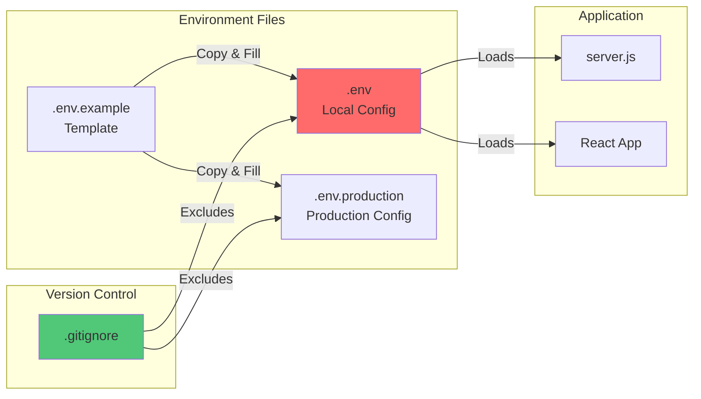
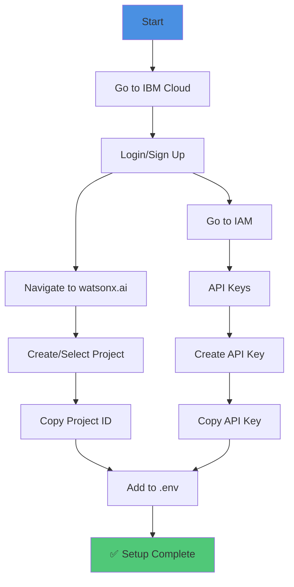

# 08 - Configuration & Environment

## Environment Configuration and Setup

This document details the configuration requirements and environment setup for DevDock.

## Environment Variables

### Required Variables

```bash
# IBM watsonx.ai Configuration
REACT_APP_WATSONX_API_KEY=your_api_key_here
REACT_APP_WATSONX_PROJECT_ID=your_project_id_here
REACT_APP_WATSONX_REGION_URL=https://us-south.ml.cloud.ibm.com
REACT_APP_WATSONX_MODEL_ID=ibm/granite-13b-chat-v2

# Server Configuration
PORT=5001
```

### Environment File Structure



## Configuration Files

### 1. .env.example

**Purpose**: Template for environment variables  
**Location**: Root directory  
**Version Control**: ✅ Committed

```bash
# IBM watsonx.ai Configuration
# Get your API key from: https://cloud.ibm.com/iam/apikeys
REACT_APP_WATSONX_API_KEY=your_api_key_here

# Get your project ID from watsonx.ai project settings
REACT_APP_WATSONX_PROJECT_ID=your_project_id_here

# Region URL (choose based on your location)
# US South: https://us-south.ml.cloud.ibm.com
# EU: https://eu-de.ml.cloud.ibm.com
# UK: https://eu-gb.ml.cloud.ibm.com
REACT_APP_WATSONX_REGION_URL=https://us-south.ml.cloud.ibm.com

# Model ID (Granite 13B Chat v2)
REACT_APP_WATSONX_MODEL_ID=ibm/granite-13b-chat-v2

# Server Port
PORT=5001
```

### 2. .env

**Purpose**: Local development configuration  
**Location**: Root directory  
**Version Control**: ❌ Not committed (in .gitignore)

```bash
# Copy from .env.example and fill with actual values
REACT_APP_WATSONX_API_KEY=actual_api_key_value
REACT_APP_WATSONX_PROJECT_ID=actual_project_id
REACT_APP_WATSONX_REGION_URL=https://us-south.ml.cloud.ibm.com
REACT_APP_WATSONX_MODEL_ID=ibm/granite-13b-chat-v2
PORT=5001
```

### 3. .gitignore

**Purpose**: Exclude sensitive files from version control  
**Location**: Root directory

```gitignore
# Environment variables
.env
.env.local
.env.production

# Dependencies
node_modules/

# Build output
build/
dist/

# IDE
.vscode/
.idea/

# OS
.DS_Store
Thumbs.db

# Logs
npm-debug.log*
yarn-debug.log*
yarn-error.log*
```

## Configuration Loading

### Server Configuration (server.js)

```javascript
require('dotenv').config();

const WATSONX_CONFIG = {
  apiKey: process.env.REACT_APP_WATSONX_API_KEY,
  projectId: process.env.REACT_APP_WATSONX_PROJECT_ID,
  regionUrl: process.env.REACT_APP_WATSONX_REGION_URL,
  modelId: process.env.REACT_APP_WATSONX_MODEL_ID,
};

// Validate configuration
if (!WATSONX_CONFIG.apiKey) {
  console.error('❌ Missing REACT_APP_WATSONX_API_KEY');
  process.exit(1);
}

if (!WATSONX_CONFIG.projectId) {
  console.error('❌ Missing REACT_APP_WATSONX_PROJECT_ID');
  process.exit(1);
}

console.log('✅ Configuration loaded successfully');
```

### React Configuration

```javascript
// Access environment variables in React
const config = {
  watsonxUrl: process.env.REACT_APP_WATSONX_REGION_URL,
  modelId: process.env.REACT_APP_WATSONX_MODEL_ID,
};

// Note: API keys should NOT be accessed in React
// They should only be used in the backend server
```

## Setup Instructions

### Initial Setup

```bash
# 1. Clone repository
git clone https://github.com/yourusername/devdock.git
cd devdock

# 2. Install dependencies
npm install

# 3. Create environment file
cp .env.example .env

# 4. Edit .env with your credentials
nano .env  # or use your preferred editor

# 5. Start backend server
node server.js

# 6. In a new terminal, start React app
npm start
```

### Getting IBM watsonx.ai Credentials



**Step-by-Step**:

1. **Create IBM Cloud Account**
   - Visit: https://cloud.ibm.com
   - Sign up for free account

2. **Access watsonx.ai**
   - Navigate to watsonx.ai service
   - Create a new project or select existing

3. **Get Project ID**
   - Open project settings
   - Copy Project ID

4. **Create API Key**
   - Go to: https://cloud.ibm.com/iam/apikeys
   - Click "Create"
   - Name: "DevDock API Key"
   - Copy the API key (save securely!)

5. **Configure .env**
   - Paste API key and Project ID
   - Select appropriate region URL

## Port Configuration

### Default Ports

```javascript
// Backend Server
const PORT = process.env.PORT || 5001;

// React Development Server
// Configured in package.json or .env
// Default: 3000
```

### Custom Port Configuration

**Backend (.env)**:
```bash
PORT=5001
```

**React (package.json)**:
```json
{
  "scripts": {
    "start": "PORT=3000 react-scripts start"
  }
}
```

**Or create .env in root**:
```bash
PORT=3000
```

## Proxy Configuration

### setupProxy.js

**Location**: `src/setupProxy.js`

```javascript
const { createProxyMiddleware } = require('http-proxy-middleware');

module.exports = function(app) {
  app.use(
    '/api',
    createProxyMiddleware({
      target: 'http://localhost:5001',
      changeOrigin: true,
      logLevel: 'debug',
    })
  );
};
```

**Purpose**:
- Proxy API requests to backend
- Avoid CORS issues in development
- Seamless API routing

## Region Configuration

### Available Regions

```javascript
const REGIONS = {
  'us-south': 'https://us-south.ml.cloud.ibm.com',
  'eu-de': 'https://eu-de.ml.cloud.ibm.com',
  'eu-gb': 'https://eu-gb.ml.cloud.ibm.com',
  'jp-tok': 'https://jp-tok.ml.cloud.ibm.com',
};
```

**Selection Criteria**:
- Geographic proximity
- Data residency requirements
- Service availability
- Latency considerations

## Model Configuration

### Available Models

```javascript
const MODELS = {
  'granite-13b-chat-v2': 'ibm/granite-13b-chat-v2',
  'granite-13b-instruct-v2': 'ibm/granite-13b-instruct-v2',
  'granite-20b-multilingual': 'ibm/granite-20b-multilingual',
};
```

**Recommended**: `ibm/granite-13b-chat-v2`
- Optimized for conversational AI
- Good balance of speed and quality
- Supports long context

## Configuration Validation

### Health Check Endpoint

```javascript
app.get('/api/health', (req, res) => {
  res.json({ 
    status: 'ok', 
    message: 'Watsonx.ai proxy server is running',
    config: {
      hasApiKey: !!WATSONX_CONFIG.apiKey,
      hasProjectId: !!WATSONX_CONFIG.projectId,
      regionUrl: WATSONX_CONFIG.regionUrl,
      modelId: WATSONX_CONFIG.modelId,
    }
  });
});
```

**Test**:
```bash
curl http://localhost:5001/api/health
```

**Expected Response**:
```json
{
  "status": "ok",
  "message": "Watsonx.ai proxy server is running",
  "config": {
    "hasApiKey": true,
    "hasProjectId": true,
    "regionUrl": "https://us-south.ml.cloud.ibm.com",
    "modelId": "ibm/granite-13b-chat-v2"
  }
}
```

## Troubleshooting

### Common Issues

#### 1. Missing Environment Variables

**Error**:
```
❌ Missing REACT_APP_WATSONX_API_KEY
```

**Solution**:
```bash
# Check .env file exists
ls -la .env

# Verify contents
cat .env

# Ensure variables are set
echo $REACT_APP_WATSONX_API_KEY
```

#### 2. CORS Errors

**Error**:
```
Access to fetch at 'http://localhost:5001/api/watsonx/generate' 
from origin 'http://localhost:3000' has been blocked by CORS policy
```

**Solution**:
- Verify CORS middleware in server.js
- Check proxy configuration in setupProxy.js
- Restart both servers

#### 3. Port Already in Use

**Error**:
```
Error: listen EADDRINUSE: address already in use :::5001
```

**Solution**:
```bash
# Find process using port
lsof -i :5001

# Kill process
kill -9 <PID>

# Or use different port
PORT=5002 node server.js
```

#### 4. Invalid API Key

**Error**:
```
IAM authentication failed (401): Invalid API key
```

**Solution**:
- Verify API key is correct
- Check for extra spaces or newlines
- Regenerate API key if needed
- Ensure key has proper permissions

## Environment-Specific Configuration

### Development

```bash
NODE_ENV=development
REACT_APP_WATSONX_REGION_URL=https://us-south.ml.cloud.ibm.com
PORT=5001
```

### Production

```bash
NODE_ENV=production
REACT_APP_WATSONX_REGION_URL=https://us-south.ml.cloud.ibm.com
PORT=80
```

### Testing

```bash
NODE_ENV=test
REACT_APP_WATSONX_REGION_URL=https://us-south.ml.cloud.ibm.com
PORT=5002
```

## Security Best Practices

### 1. Never Commit Secrets
```bash
# Always in .gitignore
.env
.env.local
.env.production
```

### 2. Use Environment Variables
```javascript
// ✅ Good
const apiKey = process.env.REACT_APP_WATSONX_API_KEY;

// ❌ Bad
const apiKey = 'hardcoded-api-key-123';
```

### 3. Rotate Keys Regularly
- Change API keys every 90 days
- Use different keys for dev/prod
- Revoke unused keys

### 4. Limit Key Permissions
- Read-only access when possible
- Scope to specific services
- Use service-specific keys

---

**Previous**: [07 - Technology Stack](./07_Technology_Stack.md)  
**Next**: [09 - User Journey Flow](./09_User_Journey_Flow.md)