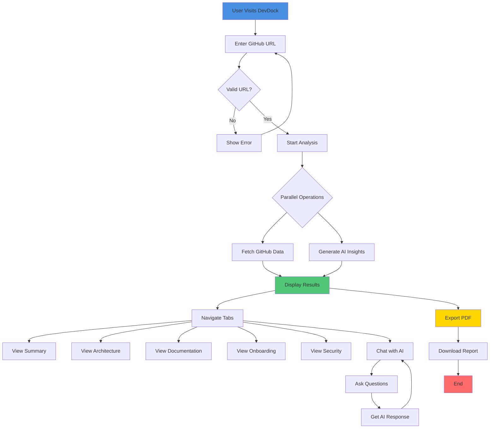
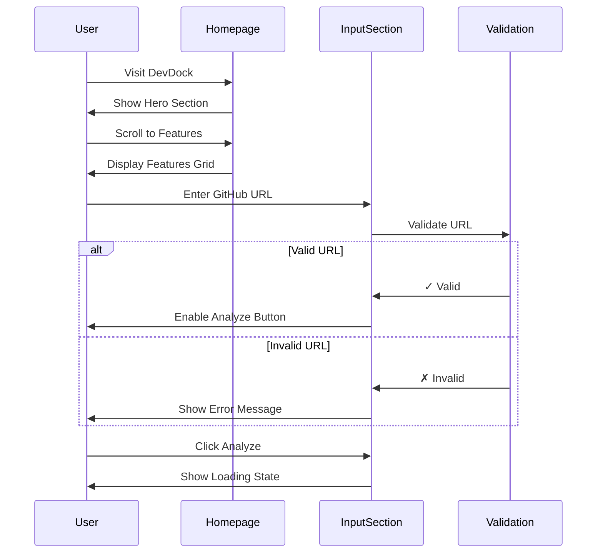
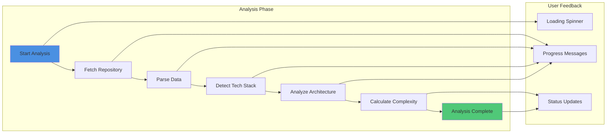
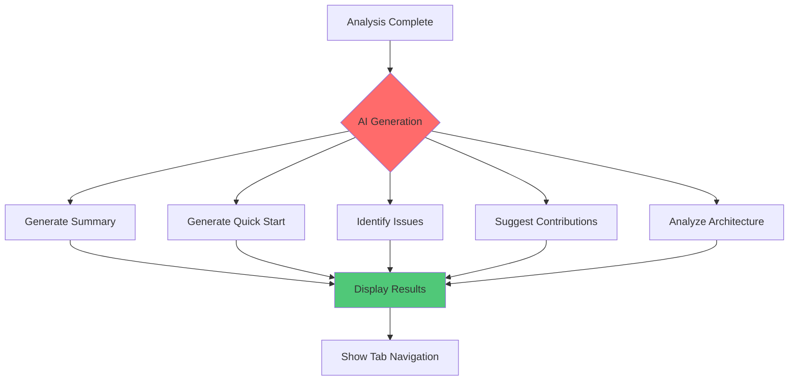
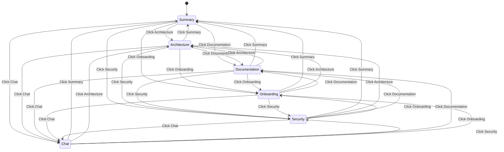
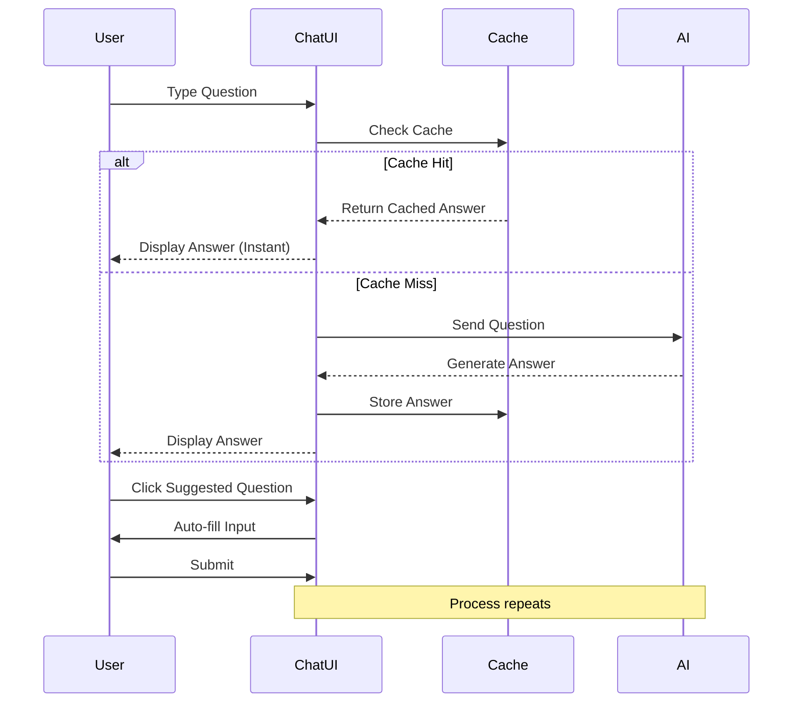
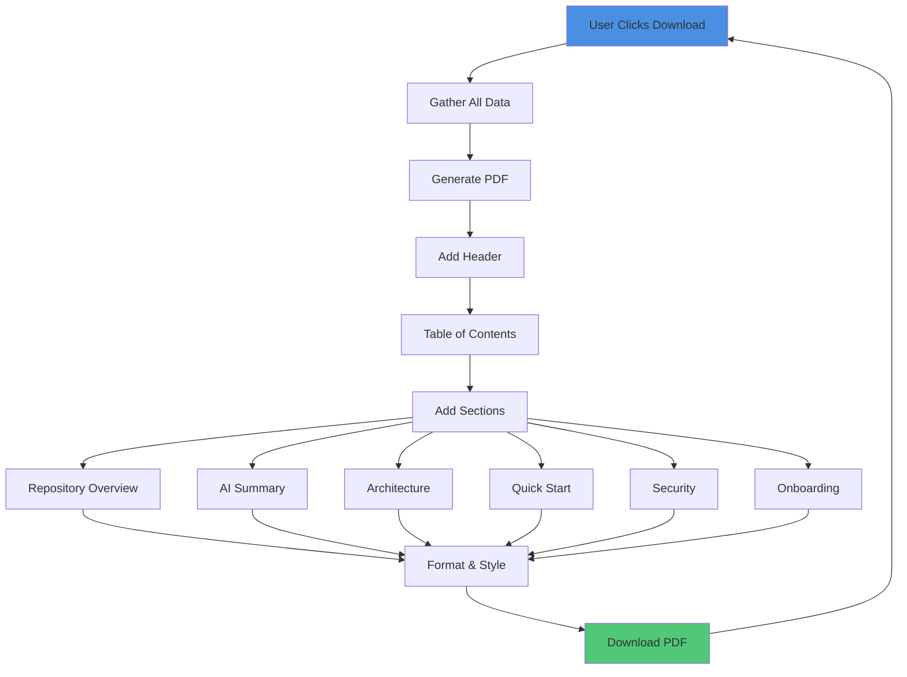

# 09 - User Journey Flow

## User Experience and Interaction Flow

This document maps out the complete user journey through the DevDock application.

## Complete User Journey



## Detailed User Flow

### Phase 1: Landing & Input



**User Actions**:
1. Visit DevDock homepage
2. Read about features
3. Enter GitHub repository URL
4. Click "Analyze Repository" button

**System Response**:
- Validate URL format
- Show loading spinner
- Disable input during analysis
- Display progress indicators

### Phase 2: Repository Analysis



**Progress Messages**:
1. "Fetching repository data..."
2. "Analyzing file structure..."
3. "Detecting technologies..."
4. "Generating AI insights..."
5. "Analysis complete! ✓"

### Phase 3: AI Generation



**AI Generation Steps**:
1. **Summary** (5-10 seconds)
   - Repository overview
   - Key technologies
   - Main features

2. **Quick Start** (5-10 seconds)
   - Setup instructions
   - Installation steps
   - First run commands

3. **Common Issues** (5-10 seconds)
   - Known problems
   - Solutions
   - Troubleshooting tips

4. **First Contributions** (5-10 seconds)
   - Beginner-friendly tasks
   - File locations
   - Implementation hints

5. **Architecture Analysis** (10-15 seconds)
   - Pattern detection
   - Component structure
   - Data flow

### Phase 4: Tab Navigation



#### Tab 1: Summary
**Content**:
- AI-generated repository summary
- Technology highlights
- Complexity score
- Time saved badge

**User Actions**:
- Read overview
- Check complexity
- View technologies

#### Tab 2: Architecture
**Content**:
- Architecture analysis
- Component diagrams
- Data flow visualization
- Technology stack details

**User Actions**:
- Explore diagrams
- Zoom/pan ReactFlow
- View component relationships

#### Tab 3: Documentation
**Content**:
- Quick start guide
- Setup instructions
- Key commands
- Environment variables

**User Actions**:
- Copy commands
- Follow setup steps
- Configure environment

#### Tab 4: Onboarding
**Content**:
- First contribution suggestions
- Common issues & solutions
- Learning resources
- Task prioritization

**User Actions**:
- Select first task
- Read implementation hints
- Check difficulty level

#### Tab 5: Security
**Content**:
- Security scan results
- Vulnerability report
- Best practices
- Recommendations

**User Actions**:
- Review issues
- Check severity
- Implement fixes

#### Tab 6: Chat
**Content**:
- Interactive AI chat
- Context-aware responses
- Suggested questions
- Chat history

**User Actions**:
- Ask questions
- Get instant answers
- Explore suggestions

### Phase 5: Chat Interaction



**Chat Features**:
- Real-time responses
- Markdown formatting
- Code syntax highlighting
- Suggested questions
- Response caching
- Context awareness

**Example Questions**:
- "How do I set up this project?"
- "What are the main components?"
- "Where should I start contributing?"
- "What technologies are used?"
- "How is the data flow structured?"

### Phase 6: PDF Export



**PDF Sections**:
1. Cover page with logo
2. Table of contents
3. Repository overview
4. AI-generated summary
5. Architecture analysis
6. Quick start guide
7. Security scan results
8. Onboarding recommendations

**User Experience**:
- Click "Download PDF" button
- See progress indicator
- Automatic download starts
- PDF opens in browser/viewer

## User Personas

### Persona 1: New Developer

**Goal**: Understand and contribute to a new project

**Journey**:
1. Enters repository URL
2. Reads AI summary
3. Follows quick start guide
4. Checks onboarding suggestions
5. Selects first contribution
6. Downloads PDF for reference

**Pain Points**:
- Overwhelming codebase
- Unclear setup process
- Don't know where to start

**DevDock Solution**:
- Clear summary
- Step-by-step guide
- Prioritized tasks
- Difficulty ratings

### Persona 2: Team Lead

**Goal**: Onboard new team members efficiently

**Journey**:
1. Analyzes team's repository
2. Reviews architecture
3. Checks security issues
4. Downloads comprehensive PDF
5. Shares with new hires

**Pain Points**:
- Time-consuming onboarding
- Repetitive explanations
- Documentation gaps

**DevDock Solution**:
- Automated documentation
- Comprehensive reports
- Shareable PDFs
- Time savings

### Persona 3: Open Source Contributor

**Goal**: Quickly understand project to contribute

**Journey**:
1. Discovers interesting project
2. Uses DevDock to analyze
3. Reads architecture overview
4. Identifies contribution area
5. Uses chat for specific questions
6. Starts contributing

**Pain Points**:
- Limited documentation
- Complex architecture
- Unclear contribution process

**DevDock Solution**:
- Instant analysis
- Visual diagrams
- AI-powered Q&A
- Contribution suggestions

## Key User Interactions

### 1. URL Input
```
User Input: https://github.com/facebook/react
↓
Validation: ✓ Valid GitHub URL
↓
Action: Enable "Analyze" button
```

### 2. Analysis Trigger
```
User Action: Click "Analyze Repository"
↓
System: Start parallel operations
↓
Feedback: Show loading states
↓
Result: Display analysis results
```

### 3. Tab Navigation
```
User Action: Click "Architecture" tab
↓
System: Load architecture content
↓
Display: Show diagrams and analysis
↓
Interaction: Enable zoom/pan on diagrams
```

### 4. Chat Interaction
```
User Input: "How do I set up this project?"
↓
System: Check cache → Generate response
↓
Display: Show formatted answer
↓
Follow-up: Suggest related questions
```

### 5. PDF Export
```
User Action: Click "Download PDF"
↓
System: Gather all data
↓
Generate: Create formatted PDF
↓
Download: Trigger browser download
```

## User Feedback Mechanisms

### Visual Feedback
- Loading spinners
- Progress bars
- Success messages
- Error notifications
- Hover effects
- Active states

### Status Messages
- "Analyzing repository..."
- "Generating AI insights..."
- "Analysis complete! ✓"
- "PDF generated successfully!"
- "Error: Invalid URL"

### Interactive Elements
- Clickable tabs
- Hoverable cards
- Zoomable diagrams
- Copyable code blocks
- Downloadable reports

## Accessibility Considerations

### Keyboard Navigation
- Tab through elements
- Enter to activate
- Escape to close
- Arrow keys for navigation

### Screen Reader Support
- Semantic HTML
- ARIA labels
- Alt text for images
- Descriptive links

### Visual Accessibility
- High contrast mode
- Readable fonts
- Clear hierarchy
- Color-blind friendly

---

**Previous**: [08 - Configuration & Environment](./08_Configuration_Environment.md)  
**Next**: [10 - Deployment Architecture](./10_Deployment_Architecture.md)