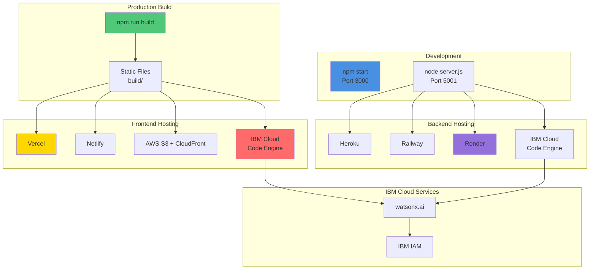
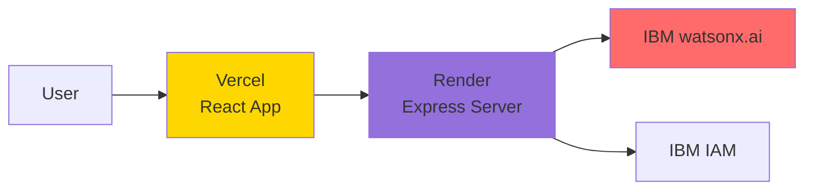
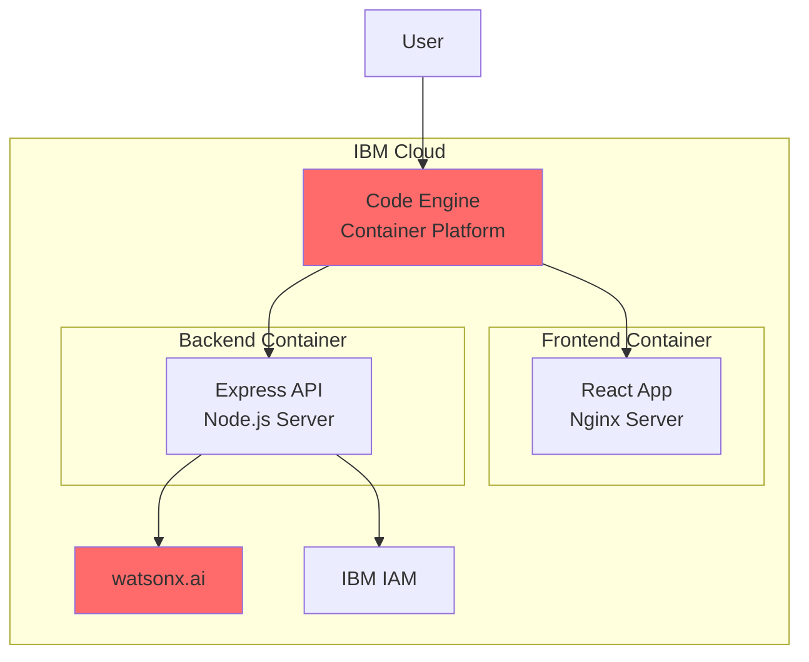
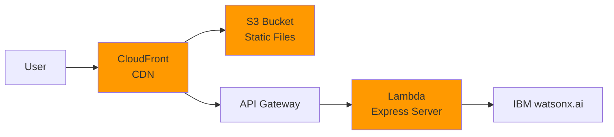
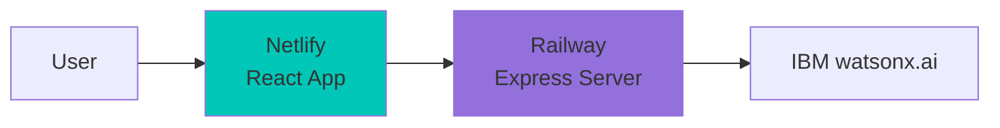
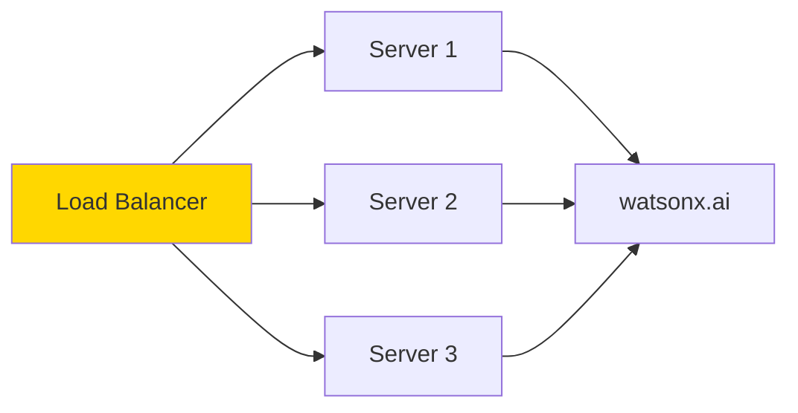

# 10 - Deployment Architecture

## Deployment Options and Infrastructure

This document outlines various deployment strategies and hosting options for DevDock, including IBM Cloud integration.

## Deployment Architecture Overview



## Deployment Options

### Option 1: Vercel + Render (Recommended)

**Frontend**: Vercel  
**Backend**: Render



**Advantages**:
- ✅ Free tier available
- ✅ Easy deployment
- ✅ Automatic HTTPS
- ✅ Global CDN
- ✅ CI/CD integration

**Setup**:

**Vercel (Frontend)**:
```bash
# Install Vercel CLI
npm i -g vercel

# Deploy
vercel

# Production deployment
vercel --prod
```

**Render (Backend)**:
1. Connect GitHub repository
2. Select `server.js` as start command
3. Add environment variables
4. Deploy

### Option 2: IBM Cloud (Full Stack)

**Frontend & Backend**: IBM Cloud Code Engine



**Advantages**:
- ✅ Native IBM Cloud integration
- ✅ Same platform as watsonx.ai
- ✅ Reduced latency
- ✅ Unified billing
- ✅ Enterprise support

**Setup**:

**1. Create Dockerfile for Frontend**:
```dockerfile
# Frontend Dockerfile
FROM node:18-alpine AS build

WORKDIR /app
COPY package*.json ./
RUN npm ci
COPY . .
RUN npm run build

FROM nginx:alpine
COPY --from=build /app/build /usr/share/nginx/html
COPY nginx.conf /etc/nginx/conf.d/default.conf
EXPOSE 80
CMD ["nginx", "-g", "daemon off;"]
```

**2. Create Dockerfile for Backend**:
```dockerfile
# Backend Dockerfile
FROM node:18-alpine

WORKDIR /app
COPY package*.json ./
RUN npm ci --only=production
COPY server.js .
COPY .env .

EXPOSE 5001
CMD ["node", "server.js"]
```

**3. Deploy to IBM Cloud Code Engine**:
```bash
# Install IBM Cloud CLI
curl -fsSL https://clis.cloud.ibm.com/install/linux | sh

# Login
ibmcloud login

# Target Code Engine
ibmcloud ce project create --name devdock

# Build and deploy frontend
ibmcloud ce application create \
  --name devdock-frontend \
  --build-source . \
  --dockerfile Dockerfile.frontend \
  --port 80

# Build and deploy backend
ibmcloud ce application create \
  --name devdock-backend \
  --build-source . \
  --dockerfile Dockerfile.backend \
  --port 5001 \
  --env REACT_APP_WATSONX_API_KEY=$API_KEY \
  --env REACT_APP_WATSONX_PROJECT_ID=$PROJECT_ID
```

### Option 3: AWS (Scalable)

**Frontend**: S3 + CloudFront  
**Backend**: EC2 or Lambda



**Advantages**:
- ✅ Highly scalable
- ✅ Pay-per-use
- ✅ Global distribution
- ✅ Robust infrastructure

### Option 4: Netlify + Railway

**Frontend**: Netlify  
**Backend**: Railway



**Advantages**:
- ✅ Simple deployment
- ✅ Free tier
- ✅ Automatic deployments
- ✅ Environment variables

## Environment Configuration

### Production Environment Variables

**Frontend (.env.production)**:
```bash
REACT_APP_API_URL=https://your-backend.render.com
REACT_APP_WATSONX_REGION_URL=https://us-south.ml.cloud.ibm.com
REACT_APP_WATSONX_MODEL_ID=ibm/granite-13b-chat-v2
```

**Backend (.env.production)**:
```bash
NODE_ENV=production
PORT=5001
REACT_APP_WATSONX_API_KEY=your_production_api_key
REACT_APP_WATSONX_PROJECT_ID=your_project_id
REACT_APP_WATSONX_REGION_URL=https://us-south.ml.cloud.ibm.com
REACT_APP_WATSONX_MODEL_ID=ibm/granite-13b-chat-v2
ALLOWED_ORIGINS=https://your-frontend.vercel.app
```

## CI/CD Pipeline

### GitHub Actions Workflow

```yaml
name: Deploy DevDock

on:
  push:
    branches: [ main ]

jobs:
  deploy-frontend:
    runs-on: ubuntu-latest
    steps:
      - uses: actions/checkout@v3
      
      - name: Setup Node.js
        uses: actions/setup-node@v3
        with:
          node-version: '18'
      
      - name: Install dependencies
        run: npm ci
      
      - name: Build
        run: npm run build
        env:
          REACT_APP_API_URL: ${{ secrets.API_URL }}
      
      - name: Deploy to Vercel
        uses: amondnet/vercel-action@v20
        with:
          vercel-token: ${{ secrets.VERCEL_TOKEN }}
          vercel-org-id: ${{ secrets.ORG_ID }}
          vercel-project-id: ${{ secrets.PROJECT_ID }}
          vercel-args: '--prod'

  deploy-backend:
    runs-on: ubuntu-latest
    steps:
      - uses: actions/checkout@v3
      
      - name: Deploy to Render
        uses: johnbeynon/render-deploy-action@v0.0.8
        with:
          service-id: ${{ secrets.RENDER_SERVICE_ID }}
          api-key: ${{ secrets.RENDER_API_KEY }}
```

## IBM Cloud Deployment (Detailed)

### Architecture on IBM Cloud

```mermaid
graph TB
    subgraph "IBM Cloud Infrastructure"
        subgraph "Code Engine"
            Frontend[Frontend App<br/>Container]
            Backend[Backend App<br/>Container]
        end
        
        subgraph "Watson Services"
            WatsonX[watsonx.ai<br/>Granite Model]
            IAM[IAM Service<br/>Authentication]
        end
        
        subgraph "Storage & CDN"
            COS[Cloud Object Storage<br/>Static Assets]
            CDN[CDN<br/>Global Distribution]
        end
        
        subgraph "Monitoring"
            LogDNA[Log Analysis]
            Monitoring[Cloud Monitoring]
        end
    end
    
    User[User] --> CDN
    CDN --> Frontend
    Frontend --> Backend
    Backend --> IAM
    IAM --> WatsonX
    
    Frontend --> LogDNA
    Backend --> LogDNA
    Frontend --> Monitoring
    Backend --> Monitoring
    
    style WatsonX fill:#FF6B6B
    style IAM fill:#FF6B6B
    style Frontend fill:#4A90E2
    style Backend fill:#50C878
```

### Step-by-Step IBM Cloud Deployment

#### 1. Prerequisites
```bash
# Install IBM Cloud CLI
curl -fsSL https://clis.cloud.ibm.com/install/linux | sh

# Install Code Engine plugin
ibmcloud plugin install code-engine

# Login to IBM Cloud
ibmcloud login --sso

# Target your resource group
ibmcloud target -g Default
```

#### 2. Create Code Engine Project
```bash
# Create project
ibmcloud ce project create --name devdock-prod

# Select project
ibmcloud ce project select --name devdock-prod
```

#### 3. Deploy Backend
```bash
# Create backend application
ibmcloud ce application create \
  --name devdock-backend \
  --image node:18-alpine \
  --port 5001 \
  --min-scale 1 \
  --max-scale 5 \
  --cpu 0.5 \
  --memory 1G \
  --env REACT_APP_WATSONX_API_KEY=$API_KEY \
  --env REACT_APP_WATSONX_PROJECT_ID=$PROJECT_ID \
  --env REACT_APP_WATSONX_REGION_URL=https://us-south.ml.cloud.ibm.com \
  --env REACT_APP_WATSONX_MODEL_ID=ibm/granite-13b-chat-v2

# Get backend URL
ibmcloud ce application get --name devdock-backend
```

#### 4. Deploy Frontend
```bash
# Build frontend with backend URL
npm run build

# Create frontend application
ibmcloud ce application create \
  --name devdock-frontend \
  --image nginx:alpine \
  --port 80 \
  --min-scale 1 \
  --max-scale 10 \
  --cpu 0.25 \
  --memory 512M

# Get frontend URL
ibmcloud ce application get --name devdock-frontend
```

#### 5. Configure Custom Domain (Optional)
```bash
# Add custom domain
ibmcloud ce application update \
  --name devdock-frontend \
  --domain devdock.yourdomain.com
```

### IBM Cloud Benefits

**1. Native Integration**
- Same platform as watsonx.ai
- Reduced network latency
- Simplified authentication
- Unified billing

**2. Auto-scaling**
- Scale to zero when idle
- Automatic scaling based on load
- Cost-effective

**3. Security**
- Built-in IAM integration
- Encrypted connections
- Private networking options
- Compliance certifications

**4. Monitoring**
- Integrated logging
- Performance metrics
- Error tracking
- Usage analytics

## Performance Optimization

### Frontend Optimization

**1. Code Splitting**
```javascript
// Lazy load components
const Architecture = lazy(() => import('./components/TabContent/Architecture'));
const Chat = lazy(() => import('./components/TabContent/Chat'));
```

**2. Asset Optimization**
```bash
# Compress images
npm install --save-dev imagemin

# Minify CSS/JS (handled by react-scripts)
npm run build
```

**3. CDN Configuration**
```javascript
// Configure CDN headers
{
  "headers": [
    {
      "source": "/static/**",
      "headers": [
        {
          "key": "Cache-Control",
          "value": "public, max-age=31536000, immutable"
        }
      ]
    }
  ]
}
```

### Backend Optimization

**1. Caching**
```javascript
// Token caching (already implemented)
let cachedToken = null;
let tokenExpiry = null;
```

**2. Connection Pooling**
```javascript
// Reuse HTTP connections
const keepAliveAgent = new https.Agent({
  keepAlive: true,
  maxSockets: 50
});
```

**3. Rate Limiting**
```javascript
const rateLimit = require('express-rate-limit');

const limiter = rateLimit({
  windowMs: 15 * 60 * 1000, // 15 minutes
  max: 100 // limit each IP to 100 requests per windowMs
});

app.use('/api/', limiter);
```

## Monitoring & Logging

### Application Monitoring

```javascript
// Add health check endpoint
app.get('/health', (req, res) => {
  res.json({
    status: 'healthy',
    timestamp: new Date().toISOString(),
    uptime: process.uptime(),
    memory: process.memoryUsage()
  });
});
```

### Error Tracking

```javascript
// Error logging middleware
app.use((err, req, res, next) => {
  console.error({
    timestamp: new Date().toISOString(),
    error: err.message,
    stack: err.stack,
    path: req.path,
    method: req.method
  });
  
  res.status(500).json({ error: 'Internal server error' });
});
```

## Scaling Considerations

### Horizontal Scaling



**Configuration**:
- Multiple backend instances
- Load balancer distribution
- Session-less architecture
- Shared cache (Redis)

### Vertical Scaling

**Resource Allocation**:
- CPU: 0.5 - 2 cores
- Memory: 512MB - 2GB
- Disk: 1GB - 5GB

## Cost Estimation

### Monthly Costs (Approximate)

**Option 1: Vercel + Render**
- Vercel (Free tier): $0
- Render (Starter): $7/month
- **Total**: ~$7/month

**Option 2: IBM Cloud**
- Code Engine (Frontend): ~$10/month
- Code Engine (Backend): ~$15/month
- watsonx.ai usage: Pay-per-use
- **Total**: ~$25-50/month

**Option 3: AWS**
- S3 + CloudFront: ~$5/month
- Lambda: ~$10/month
- **Total**: ~$15/month

## Deployment Checklist

- [ ] Environment variables configured
- [ ] API keys secured
- [ ] CORS settings updated
- [ ] HTTPS enabled
- [ ] Custom domain configured (optional)
- [ ] Monitoring set up
- [ ] Error tracking enabled
- [ ] Backup strategy defined
- [ ] CI/CD pipeline configured
- [ ] Load testing completed
- [ ] Security audit passed
- [ ] Documentation updated

---

**Previous**: [09 - User Journey Flow](./09_User_Journey_Flow.md)  
**Back to**: [README - Architecture Documentation Index](./README.md)